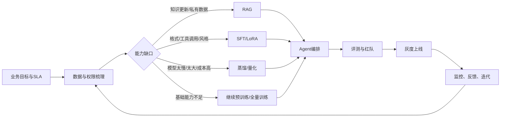
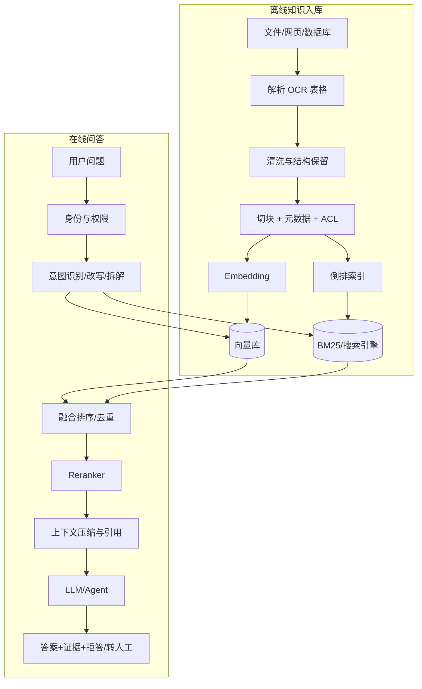
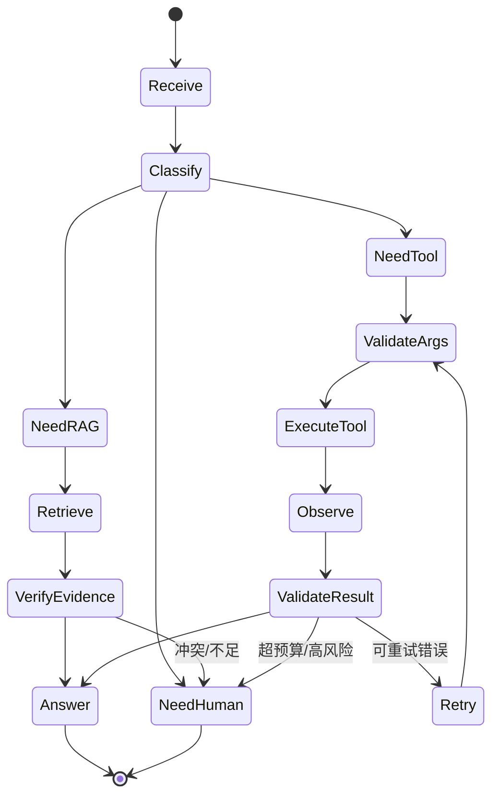

# Linux 系统部署、蒸馏、微调、训练、RAG、Agent 开发全流程指导手册

> **阅读说明**：正文中的专业名词会在首次出现后的段落附上“名词备注”；当前文件采用纯 Markdown 备注块，兼容各种 Markdown 阅读器。支持 HTML 的平台可将备注改为折叠显示。文末提供完整术语速查。

> **名词备注：Linux**
>
> **Linux**：Linux 是一种开源操作系统内核及其发行版生态。训练和 Agent 部署中，重点关注进程、文件权限、网络、磁盘、内核和驱动，而不是只会执行安装命令。


> **名词备注：Agent**
>
> **Agent**：Agent 是由模型、工具、状态、约束和停止条件组成的任务执行系统。重点不在“让模型自由发挥”，而在可控决策、权限、失败处理和审计。


> **名词备注：RAG**
>
> **RAG**：RAG（Retrieval-Augmented Generation，检索增强生成）在回答前检索外部知识，再让模型基于证据生成。它适合知识更新快、需要引用和权限控制的场景。


> **名词备注：蒸馏**
>
> **蒸馏**：知识蒸馏（Knowledge Distillation）是让学生模型学习教师模型的输出分布、答案、轨迹或中间表示，以较小成本保留目标能力。蒸馏数据必须经过事实和安全过滤。


> 面向 AI Agent / LLM 应用工程岗位的系统化准备材料。内容覆盖从 Linux GPU 环境、数据治理、继续预训练、知识蒸馏、SFT/LoRA/QLoRA、偏好优化、RAG、Agent 编排，到服务化、评测、监控和面试表达。
>
> 适合的学习顺序：先跑通一个小模型的 RAG，再做一个带工具的 Agent，然后补齐微调和蒸馏，最后练习分布式训练、线上稳定性和系统设计。
>
> 文档中的版本号和命令是示例。真正部署前要根据 GPU 型号、驱动、CUDA、PyTorch、模型许可证和企业网络策略锁定版本，并在隔离环境验证。

> **名词备注：GPU**
>
> **GPU**：GPU（Graphics Processing Unit，图形处理器）擅长并行矩阵计算，是深度学习训练和大模型推理的主要加速器。显存容量、带宽和卡间互联都会影响性能。


> **名词备注：CUDA**
>
> **CUDA**：CUDA 是 NVIDIA 提供的 GPU 并行计算平台和软件栈。驱动、CUDA runtime、PyTorch 和相关算子需要兼容，不能只看一个版本号。


> **名词备注：LLM**
>
> **LLM**：LLM（Large Language Model，大语言模型）是通过大规模文本或多模态数据训练、能够生成或理解语言的模型。面试中要区分它的参数能力、外部知识和工具执行能力。


> **名词备注：SFT**
>
> **SFT**：SFT（Supervised Fine-Tuning，监督微调）用输入与期望输出训练模型，使其学会特定任务、格式、语气或工具调用。它不等于把所有业务知识永久写进参数。


> **名词备注：LoRA**
>
> **LoRA**：LoRA（Low-Rank Adaptation）冻结基础模型，在目标层加入低秩矩阵增量。它便于训练、存储和切换多个业务 adapter，但容量和泛化需要通过评测验证。


> **名词备注：QLoRA**
>
> **QLoRA**：QLoRA 是在 4-bit 量化基础模型上训练 LoRA adapter 的方法。它降低显存，但仍需关注量化误差、计算类型、合并和推理后端兼容性。


> **名词备注：AI**
>
> **AI**：AI（Artificial Intelligence，人工智能）是让机器完成感知、推理、生成或决策任务的技术总称。大模型和 Agent 都是 AI 系统的一部分。


> **名词备注：PyTorch**
>
> **PyTorch**：PyTorch 是常用的深度学习框架，提供张量计算、自动微分、训练和分布式能力。版本要和 CUDA、量化库及模型代码一起锁定。


---

## 0. 全局地图

### 0.1 一条完整的 LLM/Agent 交付链路



> **名词备注：SLA**
>
> **SLA**：SLA（Service Level Agreement，服务等级协议）是服务提供方与使用方约定的服务指标和责任边界，常包括可用性、响应时间和故障处理要求。流程图中的“业务目标与 SLA”表示先明确系统要达到的服务质量与约束，再设计后续的数据、模型和 Agent 链路。

### 0.2 实现时要先判断问题属于哪一层

| 需求 | 优先方案 | 不要一上来做什么 |
|---|---|---|
| 企业内部制度经常变化 | RAG + 权限过滤 + 引用 | 盲目微调全部文档 |
| 输出格式固定、工具参数稳定 | SFT/LoRA，配合结构化输出 | 仅靠 prompt 堆规则 |
| 线上延迟和成本高 | 量化、蒸馏、缓存、路由、小模型分流 | 只增加 GPU |
| 模型缺少领域术语和语料风格 | 继续预训练，再 SFT | 只收集几十条问答 |
| 需要调用 CRM、搜索、计算、审批 | Agent 工作流 + 工具契约 + 人工审核 | 让模型直接执行任意命令 |
| 任务步骤固定且可审计 | DAG/状态机 | 用无限循环的自主 Agent |
| 需求经常变化、长尾问题多 | RAG + workflow + 小范围 Agent | 把所有知识写进模型参数 |

> **名词备注：workflow**
>
> **workflow**：workflow 是预先定义的任务步骤、分支和状态。高风险或可审计场景通常优先采用 workflow，而不是无限自主循环。


> **名词备注：DAG**
>
> **DAG**：DAG（Directed Acyclic Graph，有向无环图）用节点和有向边表示无环任务依赖，适合编排 ETL、评测和固定业务流程。


> **名词备注：CRM**
>
> **CRM**：CRM（Customer Relationship Management，客户关系管理）是管理客户、线索、服务和工单等业务数据的系统。Agent 访问 CRM 时要做最小权限和字段脱敏。


### 0.3 表达的核心公式

任何系统设计都可以按下面顺序回答：

1. **目标**：用户是谁，任务成功标准是什么，准确率、延迟、成本、合规边界是什么。
2. **输入**：文本、图片、表格、历史会话、权限和上下文从哪里来。
3. **路径**：路由、检索、工具、模型、状态和人工节点如何连接。
4. **失败**：检索不到、工具超时、模型幻觉、重复执行、权限不足时怎么办。
5. **指标**：离线指标、在线指标、业务指标和安全指标分别是什么。
6. **演进**：如何从 MVP 逐步演进成可观测、可回滚、可审计的生产系统。

> **名词备注：MVP**
>
> **MVP**：MVP（Minimum Viable Product，最小可行产品）是用最小范围验证业务价值的版本。Agent 项目应先做可控工作流和评测，再逐步增加自主性。


---

## 1. Linux 与 GPU 训练环境部署

### 1.1 机器规格如何估算

#### GPU 选择时看四件事

- **显存容量**：决定能否放下模型、KV cache、激活值和 batch。训练通常比推理需要更多显存。
- **显存带宽**：影响大模型推理和训练吞吐；同样显存容量不代表同样速度。
- **互联方式**：多卡训练关注 PCIe、NVLink、拓扑和 NUMA；跨节点关注 RoCE/InfiniBand、NCCL 和交换机。
- **驱动与软件兼容性**：GPU、NVIDIA driver、CUDA runtime、PyTorch、FlashAttention、量化库要一起锁定。

> **名词备注：NCCL**
>
> **NCCL**：NCCL（NVIDIA Collective Communications Library）是 NVIDIA 的多 GPU/多节点通信库，负责 all-reduce 等集合通信；分布式训练卡住时常从 NCCL、网络和 GPU 拓扑排查。


> **名词备注：PCIe**
>
> **PCIe**：PCIe 是 CPU、GPU、网卡等设备常用的高速互联总线。多卡通过 PCIe 通信时，带宽和拓扑可能限制分布式训练扩展效率。


> **名词备注：NVLink**
>
> **NVLink**：NVLink 是 NVIDIA 的高速 GPU 互联技术，通常比普通 PCIe 提供更高的卡间通信带宽。是否可用取决于 GPU 和服务器拓扑。


> **名词备注：RoCE**
>
> **RoCE**：RoCE（RDMA over Converged Ethernet）是在以太网上实现 RDMA 的技术，常用于多节点 GPU 通信。它需要交换机、网卡和拥塞控制配置配合。


> **名词备注：InfiniBand**
>
> **InfiniBand**：InfiniBand 是面向高性能计算的低延迟网络互联。多节点训练中它可降低通信延迟，但部署和运维复杂度也更高。


> **名词备注：NUMA**
>
> **NUMA**：NUMA（Non-Uniform Memory Access）表示不同 CPU 节点访问内存的代价不同。GPU、CPU、网卡和进程绑定不当时，数据搬运会变慢。


> **名词备注：FlashAttention**
>
> **FlashAttention**：FlashAttention 是一种对 attention 进行 IO 感知优化的实现，减少中间矩阵读写，通常能降低显存并提高速度。它受 GPU、序列长度和软件版本约束。


> **名词备注：KV cache**
>
> **KV cache**：KV cache 是自回归推理时缓存历史 token 的 key/value，避免每生成一个 token 都重新计算整个上下文。上下文越长、并发越高，KV cache 越可能成为显存瓶颈。


> **名词备注：NVIDIA**
>
> **NVIDIA**：NVIDIA 是常见的 GPU 和加速计算平台供应商。本文中的 CUDA、NCCL 和 Container Toolkit 均指其生态组件。


#### 资源的粗略起点

| 场景 | GPU 显存起点 | 系统内存 | 磁盘 | 备注 |
|---|---:|---:|---:|---|
| 7B/8B 推理，4-bit | 12–16 GB | 32 GB+ | 100 GB+ | 还要预留 KV cache |
| 7B/8B LoRA/QLoRA | 16–24 GB | 64 GB+ | 200 GB+ | 序列越长越吃显存 |
| 7B/8B BF16 全量微调 | 80 GB 级或多卡 | 128 GB+ | 500 GB+ | 需 ZeRO/FSDP 等 |
| 30B 级推理 | 48–80 GB 或多卡 | 128 GB+ | 500 GB+ | 依赖量化和并行策略 |
| 多节点训练 | 视模型和并行策略 | 256 GB+ | 本地 NVMe + 共享存储 | 网络常是瓶颈 |

> **名词备注：NVMe**
>
> **NVMe**：NVMe 是面向高速固态盘的协议。训练数据预取、checkpoint 和模型加载经常受磁盘吞吐影响，NVMe 可降低本地 I/O 瓶颈。


> **名词备注：BF16**
>
> **BF16**：BF16（bfloat16）是 16 位浮点格式，指数范围接近 FP32，通常比 FP16 更容易训练稳定；是否高效取决于 GPU 和算子支持。


> 估算时不要只按“参数量 × 字节数”。训练还要考虑梯度、优化器状态、激活值、临时 buffer、通信和显存碎片。Adam 类优化器的全量训练显存通常远高于模型权重本身。

> **名词备注：Adam**
>
> **Adam**：Adam 是常用的自适应优化器，维护一阶和二阶梯度统计，因此全量训练时会占用显著优化器状态显存。


#### 权重显存的快速估算

- FP32：每参数约 4 字节。
- FP16/BF16：每参数约 2 字节。
- INT8：每参数约 1 字节，实际还要加 scale/zero-point。
- INT4：每参数约 0.5 字节，实际还要加量化元数据和运行时 workspace。

> **名词备注：FP16**
>
> **FP16**：FP16（半精度浮点）可减少显存和计算量，但指数范围较小，训练时可能需要 loss scaling 或更严格的数值监控。


> **名词备注：INT8**
>
> **INT8**：INT8 是 8 位整数表示，常用于量化权重或激活。它降低内存和带宽，但需要 scale 等量化参数，并可能影响精度。


> **名词备注：INT4**
>
> **INT4**：INT4 是 4 位整数表示，常用于低比特权重量化。它能显著节省显存，但对算子、量化方法和模型质量更敏感。


> **名词备注：FP32**
>
> **FP32**：FP32 是 32 位单精度浮点格式，数值范围和精度高但显存、带宽成本更大，常用于基线或部分计算。


训练时可以粗略记忆：

```text
权重 + 梯度 + 优化器状态 + 激活 + 通信缓存
```

因此，**模型“能加载”不等于“能训练”**；**单卡能跑推理”不等于“能跑长上下文 Agent”**。

### 1.2 操作系统基线

示例以 Ubuntu LTS 为主，生产环境要以企业镜像和安全基线为准。

> **名词备注：Ubuntu**
>
> **Ubuntu**：Ubuntu 是常见的 Linux 发行版。这里用 Ubuntu LTS 作为示例，生产环境应遵守公司的基础镜像和安全基线。


```bash
# 查看系统与内核
cat /etc/os-release
uname -a
lscpu
free -h
lsblk

# 查看当前用户、磁盘和挂载点
id
df -hT
mount | column -t

# 时间同步，任选企业允许的方案
timedatectl status
sudo timedatectl set-timezone Asia/Shanghai
```

建议做这些基础设置：

- 为训练和服务创建独立用户，禁止业务进程直接用 root。
- 训练数据、模型权重、日志、缓存分盘或至少分目录。
- 通过 SSH key 登录，关闭密码登录要先确认有带外管理通道。
- 统一时区和 NTP，否则分布式日志、token 过期、指标时间轴会混乱。
- 给训练用户配置合理的 `ulimit`，避免数据加载器打开文件失败。
- 禁止把 API key、数据库密码、用户 PII 写进 Git、镜像层和日志。

> **名词备注：SSH**
>
> **SSH**：SSH（Secure Shell）是远程登录和执行命令的加密协议。生产机器通常使用密钥、最小权限和审计，不建议共享 root 密码。


> **名词备注：NTP**
>
> **NTP**：NTP（Network Time Protocol）用于让机器时钟与时间源同步。训练日志、分布式 trace、证书和令牌过期都依赖时间基本一致。


> **名词备注：token**
>
> **token**：token 是模型 tokenizer 切分出的最小文本单位，可能是字、词、子词或标点。上下文长度、计费、batch 和训练步数通常按 token 估算。


> **名词备注：PII**
>
> **PII**：PII（Personally Identifiable Information，可识别个人信息）包括手机号、证件号、地址等，也可能通过多个字段组合识别个人。训练、日志、向量库和缓存都要纳入脱敏与删除策略。


> **名词备注：API**
>
> **API**：API（Application Programming Interface，应用程序接口）是软件之间约定的调用边界。Agent 的工具、模型网关和检索服务都应通过清晰的 API 契约连接。


> **名词备注：Git**
>
> **Git**：Git 是版本控制系统。模型、prompt、数据 manifest、配置和服务代码都应记录 commit 或版本号，方便回放和回滚。


```bash
# /etc/security/limits.d/llm.conf 的示例思路
# <user> soft nofile 1048576
# <user> hard nofile 1048576
# <user> soft memlock unlimited
# <user> hard memlock unlimited

ulimit -n
ulimit -l
```

### 1.3 NVIDIA 驱动、CUDA 与 NCCL

#### 安装原则

1. 先确认 GPU 型号、发行版和企业允许的驱动来源。
2. 只选一种安装方式：发行版包管理、官方仓库或镜像；不要混装 runfile 和 apt 包。
3. 驱动版本必须满足目标 CUDA runtime 的最低要求。
4. 容器里通常使用宿主机驱动，容器内安装 CUDA runtime；不要在容器里重复安装内核驱动。

```bash
# 硬件检查
lspci | grep -i -E 'nvidia|amd|display'

# 安装完成后验证
nvidia-smi
nvidia-smi --query-gpu=name,driver_version,memory.total --format=csv

# 如果安装了 CUDA toolkit
nvcc --version
```

常见现象与排查：

| 现象 | 先查什么 | 典型原因 |
|---|---|---|
| `nvidia-smi` 找不到 | `lsmod | grep nvidia`、`dmesg` | 驱动未加载、内核不匹配、Secure Boot |
| 容器里看不到 GPU | Toolkit、运行参数、宿主机驱动 | 未配置 `nvidia-container-toolkit` |
| 多卡初始化卡住 | `nvidia-smi topo -m`、NCCL 日志 | 拓扑、网卡、NCCL、端口或防火墙 |
| `CUDA out of memory` | batch、seq_len、并发、显存碎片 | 激活值/KV cache 太大 |
| `CUDA error: invalid device` | `CUDA_VISIBLE_DEVICES` | 设备编号映射错 |

> **名词备注：nvidia-smi**
>
> **nvidia-smi**：nvidia-smi 是 NVIDIA 提供的 GPU 状态查看工具，可查看显存、利用率、温度、进程和驱动版本。它是训练故障排查的第一步之一。


> **名词备注：CUDA_VISIBLE_DEVICES**
>
> **CUDA_VISIBLE_DEVICES**：CUDA_VISIBLE_DEVICES 是用于限制和重映射进程可见 GPU 的环境变量。多卡启动时要确认它与 rank/world size 的映射一致。


分布式调试时可以临时使用：

```bash
export NCCL_DEBUG=INFO
export TORCH_DISTRIBUTED_DEBUG=DETAIL
# 只有在确认网络配置需要时再设置，避免复制网上的禁用项
# export NCCL_SOCKET_IFNAME=eth0
```

### 1.4 Docker 与 NVIDIA Container Toolkit

> **名词备注：Docker**
>
> **Docker**：Docker 是容器运行时和镜像生态。它可以固定用户态依赖，但不能替代宿主机的 GPU 驱动、内核、磁盘和网络治理。


> **名词备注：NVIDIA Container Toolkit**
>
> **NVIDIA Container Toolkit**：NVIDIA Container Toolkit 让 Docker 等容器运行时把宿主机 GPU 暴露给容器。它使用宿主机驱动，容器内通常只带匹配的 CUDA runtime。


容器的目的是固定依赖、隔离进程、方便复现。宿主机仍要负责 GPU 驱动、内核、磁盘和网络。

```bash
# Docker 安装按企业镜像或官方文档执行，安装后验证
sudo systemctl enable --now docker
docker version

# NVIDIA Container Toolkit 配好后验证
docker run --rm --gpus all \
  nvidia/cuda:12.4.1-base-ubuntu22.04 \
  nvidia-smi
```

一个训练容器至少要考虑：

```bash
docker run --rm -it --gpus all \
  --shm-size=16g \
  --ipc=host \
  --ulimit memlock=-1 \
  --ulimit stack=67108864 \
  -v /data:/workspace/data \
  -v /models:/workspace/models \
  -v "$PWD":/workspace/project \
  --name llm-dev \
  your-registry/llm-runtime:tag
```

- `--shm-size` 和 `--ipc=host` 经常影响多进程 DataLoader。
- 挂载目录要只读/读写分开，敏感数据不要整个宿主机目录暴露给容器。
- 生产镜像应固定 digest 或内部版本，而不是长期使用 `latest`。
- 镜像里不放模型密钥；通过 secret、环境变量或工作负载身份注入。

> **名词备注：DataLoader**
>
> **DataLoader**：DataLoader 是把数据集批量读取、打乱、并行预取并交给训练进程的组件。多进程、共享内存、磁盘和样本格式都会影响它是否成为瓶颈。


> **名词备注：shm-size**
>
> **shm-size**：shm-size 是 Docker 容器共享内存大小配置。多进程 DataLoader 或进程间通信使用共享内存时过小会导致异常或性能下降。


### 1.5 Python 环境与依赖锁定

> **名词备注：Python**
>
> **Python**：Python 是本手册示例使用的编程语言，常用于数据处理、训练、RAG、Agent 和 API 服务。生产环境要锁定解释器和依赖版本。


可以用 Conda、uv、venv 或企业内部运行时。关键是做到：

> **名词备注：Conda**
>
> **Conda**：Conda 是环境和依赖管理工具，能同时管理 Python 包和部分系统库。无论使用 Conda、venv 还是 uv，都要导出可复现的锁定信息。


- 每个项目有独立环境。
- `torch`、CUDA、transformers、accelerate、peft、trl、量化库和驱动版本有记录。
- 安装完成后导出锁定文件和硬件信息。
- 训练脚本、数据版本、配置、镜像标签和 checkpoint 互相可追溯。

> **名词备注：checkpoint**
>
> **checkpoint**：checkpoint 是训练或任务状态的可恢复快照，可能包含模型权重、adapter、优化器、学习率调度器、步数和随机状态。生产训练必须验证它真的能恢复。


```bash
python3 -m venv .venv
source .venv/bin/activate
python -m pip install -U pip wheel

# 依赖版本以目标 CUDA 和内部镜像为准
pip install torch transformers datasets accelerate peft trl safetensors \
  sentencepiece einops evaluate

pip freeze > requirements.lock.txt
python - <<'PY'
import platform, sys
print(platform.platform())
print(sys.version)
try:
    import torch
    print('torch', torch.__version__)
    print('cuda available', torch.cuda.is_available())
    print('cuda version', torch.version.cuda)
    if torch.cuda.is_available():
        print(torch.cuda.get_device_name(0))
except Exception as exc:
    print('torch check failed:', repr(exc))
PY
```

### 1.6 项目目录建议

```text
project/
├── configs/                 # yaml/json 配置，禁止放密钥
├── data/
│   ├── raw/                 # 原始只读数据
│   ├── interim/             # 清洗中间产物
│   ├── processed/           # 可训练/可索引数据
│   └── manifests/           # 版本、哈希、来源、授权
├── scripts/                 # 一次性或运维脚本
├── src/
│   ├── data/
│   ├── train/
│   ├── rag/
│   ├── agent/
│   └── serving/
├── evals/                   # 离线集、红队集、回归集
├── checkpoints/             # 可配置为外部对象存储
├── logs/
├── docker/
├── pyproject.toml
└── README.md
```

### 1.7 进程、日志和作业管理

开发阶段可以用 `tmux`，生产阶段使用调度器或 systemd/Kubernetes Job。

> **名词备注：systemd**
>
> **systemd**：systemd 是 Linux 常用的初始化和服务管理系统。它适合管理长期运行的 API、worker、模型服务和重启策略。


> **名词备注：tmux**
>
> **tmux**：tmux 是终端复用器，可以在 SSH 断开后保留会话。它适合开发和调试；生产作业仍应使用调度器、systemd 或 Kubernetes Job。


> **名词备注：Kubernetes**
>
> **Kubernetes**：Kubernetes 是容器编排平台，负责调度、滚动发布、服务发现、扩缩容和故障恢复。训练 Job 与在线推理 Deployment 的资源策略不同。


```bash
tmux new -s train
# 运行训练
Ctrl-b d

tmux attach -t train

# 查看进程和 GPU
ps -ef | grep -E 'python|torchrun' | grep -v grep
watch -n 1 nvidia-smi
```

生产运行要有：

- 作业 ID、提交人、代码 commit、镜像 digest、配置版本。
- stdout/stderr 集中采集，并设置日志级别、脱敏和保留周期。
- checkpoint 定期保存，并测试恢复，不要只“相信保存成功”。
- 训练失败可重试，但要限制重试次数，避免 GPU 作业无限烧钱。

---

## 2. 数据治理：训练、RAG 和 Agent 的共同地基

### 2.1 先定义任务和数据契约

数据进入模型前要回答：

- 来源是什么，是否有使用授权，谁负责更新和下线？
- 字段含义、字符编码、语言、时间范围是什么？
- 是否包含身份证号、手机号、健康信息、金融信息、内部工号等敏感数据？
- 一条样本的输入、上下文、期望输出、工具轨迹、标签分别是什么？
- 训练/验证/测试是否按用户、案件、文档和时间隔离，避免泄漏？

建议为每个数据集维护 manifest：

> **名词备注：manifest**
>
> **manifest**：manifest 是数据、模型或发布产物的清单，记录版本、来源、授权、哈希、schema 和负责人。它让训练结果可以追溯和复现。


```json
{
  "dataset_name": "customer_service_sft",
  "version": "2026-09-29.v3",
  "source": "approved_internal_export",
  "license_or_authorization": "ticket-xxxx",
  "language": ["zh"],
  "schema_version": "sft.chat.v1",
  "row_count": 120000,
  "pii_status": "masked",
  "dedup_method": "minhash+exact",
  "split_rule": "by_customer_and_time",
  "content_hash": "sha256:...",
  "owner": "team-name"
}
```

### 2.2 数据类型和用途

| 数据类型 | 作用 | 典型格式 | 关键风险 |
|---|---|---|---|
| 继续预训练语料 | 学术语、领域表达、知识结构 | 文本/JSONL | 版权、重复、污染评测集 |
| 指令微调 | 学任务、格式、工具调用 | chat JSONL | 低质量模板、答案泄漏 |
| 偏好数据 | 学“哪个回答更好” | chosen/rejected | 偏好标注偏差、奖励投机 |
| RAG 文档 | 运行时提供事实 | 文档块+元数据 | 版本、权限、引用丢失 |
| Agent 轨迹 | 学规划和工具使用 | messages/tool calls | 错误轨迹、危险动作被模仿 |
| 评测集 | 量化回归和上线门槛 | question/expected | 被训练集污染 |

> **名词备注：JSONL**
>
> **JSONL**：JSONL（JSON Lines）是每行一个 JSON 对象的文本格式，适合流式读取训练样本、评测样本和日志。每行都应符合固定 schema。


> **名词备注：JSON**
>
> **JSON**：JSON（JavaScript Object Notation）是常用的结构化数据格式。工具参数、API 请求和评测样本要配合 schema 做解析和校验。


### 2.3 清洗、去重和质量控制

一个可解释的数据流水线通常包含：

1. 编码统一、空值和异常字符处理。
2. 去 HTML、去导航栏、保留标题和列表层级。
3. 精确去重，再做 MinHash/SimHash 近似去重。
4. 语言识别和长度过滤。
5. PII/敏感信息识别、脱敏或删除。
6. 垃圾文本、广告、乱码、重复模板、无意义短句过滤。
7. 质量评分：完整性、正确性、可读性、时效性、引用可追溯性。
8. 按用户/订单/案件/文档/时间切分，避免同一实体泄漏到不同 split。
9. 抽样人工复核，记录被过滤样本和原因。

> **名词备注：MinHash**
>
> **MinHash**：MinHash 是估计集合 Jaccard 相似度的哈希方法，常用于大规模近似去重。它速度快，但阈值和分词方式会影响结果。


> **名词备注：SimHash**
>
> **SimHash**：SimHash 是把文本映射成相似文本汉明距离较小的指纹，常用于近似重复检测。它适合快速筛选，最终仍可用更精确方法复核。


> **名词备注：HTML**
>
> **HTML**：HTML（HyperText Markup Language）是网页标记语言。本文使用的 details 元素也是 HTML，支持在多数 Markdown 渲染器中折叠查看。


可记录的统计指标：

```text
保留率 = 保留样本数 / 原始样本数
重复率 = 重复样本数 / 清洗前样本数
PII命中率
平均输入/输出 token 数
空答案率、格式错误率、拒答率
按来源、日期、业务线的分布
```

### 2.4 对话和工具调用数据格式

#### SFT chat JSONL

```json
{"messages":[{"role":"system","content":"你是客服助手，只能根据已提供资料回答，并在不确定时转人工。"},{"role":"user","content":"理赔材料需要哪些？"},{"role":"assistant","content":"根据当前版本的材料清单，需要……\n\n来源：材料清单 v3.2"}]}
```

#### 带工具调用的样本

```json
{
  "messages": [
    {"role":"user", "content":"帮我查询订单 A123 的物流状态"},
    {"role":"assistant", "tool_calls":[{"name":"query_logistics","arguments":{"order_id":"A123"}}]},
    {"role":"tool", "name":"query_logistics", "content":"{\"status\":\"运输中\",\"updated_at\":\"2026-09-29T09:00:00+08:00\"}"},
    {"role":"assistant", "content":"订单 A123 目前在运输中，最近更新时间为 2026-09-29 09:00。"}
  ]
}
```

#### 偏好数据

```json
{
  "prompt": "用户询问报销范围，知识库中没有对应条款。",
  "chosen": "我在当前资料中没有找到该条款，不能直接判断。可以补充保单版本或转人工核实。",
  "rejected": "通常都可以报销，您直接提交就行。"
}
```

### 2.5 数据安全底线

- PII 脱敏不能只替换手机号；要覆盖姓名、证件、地址、账号、健康和财务字段，以及组合识别风险。
- RAG 的访问控制必须在检索前或检索时生效，不能只靠模型“记住不要泄露”。
- 训练集、日志、向量库、缓存、备份和标注平台都要纳入删除/留存策略。
- 评测集不要被线上日志自动回流，否则会导致指标虚高。
- 任何自动生成的数据都要保留生成模型、prompt、时间、过滤规则和人工采样结果。

---

## 3. 训练范式与显存/并行基础

### 3.1 四种训练工作

1. **继续预训练（Continued Pretraining）**：用无标注领域文本继续训练语言建模目标，让模型熟悉术语和写法。
2. **监督微调（SFT）**：用输入-答案、对话、工具调用等监督样本学习任务行为。
3. **偏好优化**：用 chosen/rejected、奖励模型或规则信号调整回答偏好。
4. **全量预训练/从头训练**：数据、算力、分布式和工程成本最高，面试中需要理解但一般不作为业务首选。

一个实用决策：

```text
知识变化快       -> RAG
格式/流程不稳定  -> prompt + workflow
格式/工具调用稳定-> SFT/LoRA
领域语言能力弱   -> 继续预训练 + SFT
模型太大/太慢    -> 量化 + 蒸馏 + 路由
```

### 3.2 Transformer 训练损失

> **名词备注：Transformer**
>
> **Transformer**：Transformer 是以 self-attention 为核心的神经网络架构，现代大语言模型大多基于它。它的显存和计算开销会随序列长度显著增长。


自回归语言模型通常最小化下一个 token 的交叉熵：

```text
L_lm = - Σ_t log pθ(x_t | x_<t)
```

监督微调时，通常只对 assistant 输出 token 计算 loss，system/user 上下文作为条件输入。面试时要说明：

- 是否使用 label mask；
- chat template 是否一致；
- padding 和 `ignore_index` 是否正确；
- 长文本截断是否把答案截掉；
- 训练/推理的 tokenizer、special tokens、EOS 是否一致。

> **名词备注：tokenizer**
>
> **tokenizer**：tokenizer 把文本转换成 token ID，也负责反向解码。训练和推理必须使用兼容的 tokenizer、词表、特殊 token 和 EOS 设置。


> **名词备注：chat template**
>
> **chat template**：chat template 是把 system/user/assistant/tool 消息拼成模型训练和推理所需文本格式的模板。模板不一致会导致工具调用、角色边界和 loss mask 出错。


> **名词备注：label mask**
>
> **label mask**：label mask 决定哪些 token 参与监督损失。SFT 通常只对 assistant 输出计算 loss，把 system/user 上下文设置为忽略值，避免模型学习复述提示。


> **名词备注：EOS**
>
> **EOS**：EOS（End Of Sequence）是表示序列结束的特殊 token。训练和生成时 EOS 配置不一致可能导致模型不停止或答案截断。


### 3.3 单卡、数据并行和模型并行

- **数据并行（DDP）**：每张卡有一份模型，输入 batch 分片；适合模型能放进单卡。
- **FSDP/ZeRO**：切分参数、梯度、优化器状态，降低单卡显存。
- **张量并行（TP）**：把单层矩阵切到多卡，适合大模型推理/训练。
- **流水线并行（PP）**：把层切到不同卡，需处理 micro-batch 和 pipeline bubble。
- **专家并行（EP）**：MoE 模型将专家分布到不同设备。
- **序列并行/上下文并行**：长上下文场景切分序列或 attention 计算。

> **名词备注：DDP**
>
> **DDP**：DDP（Distributed Data Parallel，分布式数据并行）通常让每张 GPU 保存一份模型，输入按卡切分，再通过梯度集合通信同步更新。


> **名词备注：FSDP/ZeRO**
>
> **FSDP/ZeRO**：FSDP（Fully Sharded Data Parallel）和 ZeRO（Zero Redundancy Optimizer）都通过切分参数、梯度或优化器状态降低单卡显存。FSDP 更贴近 PyTorch 原生生态，ZeRO 常见于 DeepSpeed；具体选择要看通信、模型和运维条件。


> **名词备注：MoE**
>
> **MoE**：MoE（Mixture of Experts，混合专家）模型包含多个专家网络，每个 token 只路由到少数专家，因此参数总量很大但单 token 激活参数较少。专家负载不均会影响吞吐。


> **名词备注：micro-batch**
>
> **micro-batch**：micro-batch 是一次前向/反向实际处理的小批次。通过多次 micro-batch 的梯度累积可以模拟更大的有效 batch。


面试追问时可以这样讲：先根据模型是否能放入单卡选择 DDP 或 FSDP/ZeRO；再根据跨卡通信和序列长度选择 TP/PP/序列并行；最终用吞吐、显存、扩展效率和实现复杂度做权衡。

### 3.4 影响显存和吞吐的开关

| 技术 | 作用 | 代价 |
|---|---|---|
| BF16/FP16 | 降低权重和激活显存 | 需关注数值稳定性，FP16 常需 loss scaling |
| 梯度累积 | 用多个 micro-batch 模拟大 batch | 单步更新变慢，需正确处理 loss 平均 |
| Gradient checkpointing | 不保存全部激活，反向重算 | 增加计算时间 |
| FlashAttention/SDPA | 降低 attention 内存和提升速度 | 受硬件、序列长度、版本约束 |
| Packing | 把短样本拼到同一序列 | 需正确处理边界和 loss mask |
| 8-bit/4-bit 量化 | 降低权重显存 | 可能损失精度，训练方式有限制 |
| ZeRO/FSDP | 切分状态 | 通信和配置复杂 |

> **名词备注：SDPA**
>
> **SDPA**：SDPA（Scaled Dot-Product Attention）是缩放点积注意力接口，框架可根据硬件选择不同的高效实现。它不是一个具体模型，而是一类 attention 计算 API/路径。


有效 batch size 的常见表达：

```text
effective_batch = per_device_batch × num_devices × gradient_accumulation_steps
```

### 3.5 一个可恢复的训练命令

```bash
torchrun \
  --standalone \
  --nproc_per_node=4 \
  src/train/sft.py \
  --config configs/sft.yaml \
  --output_dir checkpoints/run-001 \
  --resume_from_checkpoint checkpoints/run-001/checkpoint-last
```

训练配置应写入文件而不是散落在 shell 历史中：

```yaml
model_name_or_path: /models/base-model
train_file: data/processed/sft-v3.jsonl
validation_file: data/processed/valid-v1.jsonl
max_seq_length: 4096
per_device_train_batch_size: 2
gradient_accumulation_steps: 16
learning_rate: 2.0e-5
num_train_epochs: 2
lr_scheduler_type: cosine
warmup_ratio: 0.03
bf16: true
gradient_checkpointing: true
logging_steps: 10
eval_steps: 200
save_steps: 200
save_total_limit: 3
seed: 42
```

### 3.6 训练时必须记录什么

- 代码 commit、配置文件 hash、数据 manifest、基础模型版本和 tokenizer 版本。
- GPU 型号、驱动、CUDA、PyTorch、分布式后端。
- step、loss、learning rate、吞吐、显存、梯度范数、溢出/NaN。
- 验证集 loss、任务指标、固定样例输出。
- checkpoint 是否可加载、是否可从中断处继续。
- 训练成本、耗时、失败重试和最终产物位置。

> **名词备注：NaN**
>
> **NaN**：NaN（Not a Number）表示数值计算出现非法或未定义结果。训练中的 NaN 常与学习率、混合精度、数据异常或梯度爆炸有关。


---

## 4. 蒸馏：把大模型能力迁移到更小、更快的模型

### 4.1 蒸馏解决什么问题

蒸馏的目标不是简单“把大模型压小”，而是让学生模型在目标任务和约束下保留教师模型的有效行为，同时降低：

- 首 token 延迟和每 token 延迟；
- 显存与并发成本；
- 推理价格和部署复杂度；
- Agent 工作流中大量重复的小任务的调用成本。

### 4.2 经典 logits 蒸馏

> **名词备注：logits**
>
> **logits**：logits 是模型 softmax 前的未归一化分数。蒸馏常让学生匹配教师 logits 或其温度缩放后的概率分布。


教师模型输出 soft target 分布，学生模型学习它：

```text
p_T = softmax(z_T / τ)
p_S = softmax(z_S / τ)
L_KD = τ² · KL(p_T || p_S)
L = α · L_KD + (1 - α) · L_CE
```

- `τ` 是 temperature，越高分布越平滑，能暴露次优 token 的相对偏好。
- `α` 控制教师分布与真实标签的权重。
- `τ²` 用于保持梯度尺度，实际实现要核对框架定义。
- 生成式大模型常用 token-level 蒸馏，也可以用序列级别、隐藏状态和注意力蒸馏。

> **名词备注：temperature**
>
> **temperature**：temperature（温度）控制 softmax 分布的平滑程度。温度高时次优 token 的相对信息更明显，生成时温度高通常也会带来更多随机性。


### 4.3 业务上更常见的蒸馏方式

#### 1. 响应蒸馏（response distillation）

让教师模型为真实问题生成高质量答案、拒答、工具调用和引用，然后用这些结果做 SFT。成本低、实现简单、适合没有教师 logits 的 API 场景。

风险：教师幻觉会被复制；需要规则过滤、事实校验、人工抽样和去重。

#### 2. 轨迹蒸馏（trajectory distillation）

教师 Agent 完成任务，记录：

```text
用户目标 -> 任务分解 -> 工具选择 -> 参数 -> 工具结果 -> 修正 -> 最终答案
```

学生模型学习工具选择和格式，适合客服分流、检索路由和结构化工作流。

#### 3. RAG 蒸馏

教师负责生成高质量查询改写、文档排序、答案引用和“不知道”判断；学生模型负责低成本完成其中一部分。可以蒸馏：

- query rewrite；
- 相关性打分；
- reranker；
- grounded answer；
- 证据选择。

> **名词备注：reranker**
>
> **reranker**：reranker（重排序模型）对初步召回的 query-document 对做更精细的相关性判断。它通常提高精度，但会增加一次模型推理延迟。


> **名词备注：query rewrite**
>
> **query rewrite**：query rewrite（查询改写）把用户口语、歧义或多跳问题转换成更适合检索的查询。必须保留原问题和约束，避免改写产生新意图。


#### 4. 特征/隐藏状态蒸馏

让学生中间层拟合教师的隐藏表示、attention 或 logits。需要教师与学生 tokenizer、层数、维度有映射，工程复杂度更高。

### 4.4 蒸馏流水线

```text
定义目标模型和SLA
  -> 采样真实任务与难例
  -> 教师生成答案/轨迹/评分
  -> 规则、检索、人工过滤
  -> 训练学生模型
  -> 与教师、基线、规则系统对比
  -> 量化、部署、线上灰度
  -> 监控长尾和安全回退
```

### 4.5 让蒸馏可控的做法

- 训练数据中同时保留教师答案和证据/工具结果，不要只保留漂亮文本。
- 给教师输出增加结构化字段：`is_abstain`、`citations`、`tool_name`、`risk_level`。
- 对高风险领域设置硬规则：无证据不得给确定性结论，必须转人工。
- 将简单样本和难样本分层采样，避免学生只学到平均风格。
- 单独评估拒答、引用、工具参数、安全越权和长尾，不只看平均准确率。
- 量化前后分别测质量、延迟、峰值显存和并发，不要用“模型大小减少了”代替上线结论。

### 4.6 蒸馏常见失败

| 失败 | 原因 | 修复 |
|---|---|---|
| 学生只会复述教师口吻 | 数据只有答案，没有任务结构 | 加入工具、证据、失败和拒答样本 |
| 幻觉变多 | 教师错误被批量复制 | 检索校验、规则过滤、人工抽样 |
| 工具参数经常错 | 轨迹格式和 schema 不稳定 | 固定工具 schema，做 JSON 校验和重试 |
| 简单集很好，长尾很差 | 采样分布偏 | 难例和线上失败回流，但隔离评测集 |
| 速度没有明显提升 | 框架、batch、KV cache 或 IO 成瓶颈 | 端到端 profiling，不只测 token/s |

---

## 5. 微调：SFT、LoRA、QLoRA 和偏好优化

### 5.1 先判断是否真的需要微调

使用下面的顺序可以避免把 RAG 的问题误判成训练问题：

1. prompt、输出格式和工具 schema 是否清晰？
2. 知识是否会变化，是否应该放在 RAG？
3. 有没有至少一批高质量、去重、可追溯的标注样本？
4. 评测集是否能区分“事实不对”和“行为格式不对”？
5. 线上预算是否允许训练、部署和回滚？

适合微调的信号：

- 固定业务格式总是出错；
- 工具选择和参数有稳定规律；
- 风格、语气、拒答、分类标签需要一致；
- prompt 已经很长仍然不稳定；
- 有明确的训练/验证/回归集。

### 5.2 LoRA 的原理和关键参数

LoRA 冻结基础模型权重 `W`，只训练低秩增量：

```text
W' = W + ΔW
ΔW = B A
```

常用参数：

- `r`：低秩维度，越大容量越高，也更耗显存和可能过拟合。
- `lora_alpha`：缩放系数，常与 `r` 一起调。
- `lora_dropout`：正则化。
- `target_modules`：注入模块，如 attention 的 q/k/v/o 和部分 MLP 投影；要根据模型结构确认名称。
- `modules_to_save`：需要一起训练的 embedding、lm_head 或分类头。
- `bias`：是否训练 bias。

> **名词备注：embedding**
>
> **embedding**：embedding 是把文本、图像或实体映射成向量表示。RAG 用它做语义相似检索，但它不能代替关键词检索、权限过滤和版本判断。


> **名词备注：MLP**
>
> **MLP**：MLP（Multi-Layer Perceptron，多层感知机）是 Transformer 中常见的前馈子层。LoRA 的 target_modules 是否包含 MLP 投影要按模型结构和任务验证。


经验起点：先从 `r=8/16/32`、`alpha=16/32/64`、小学习率开始，比较验证集和格式/工具指标，不要默认“r 越大越好”。

### 5.3 QLoRA 的思路

QLoRA 通常把基础模型以 4-bit 量化加载，计算时使用 BF16/FP16，LoRA adapter 保持可训练，从而在较小显存上完成微调。

注意：

- 4-bit 量化配置要和硬件、量化库、推理后端兼容。
- QLoRA 适合参数高效微调，不等于可以低成本做全量训练。
- 合并 adapter 前后要分别评测；量化和合并可能改变精度。
- `max_seq_length`、packing、梯度检查点对显存影响很大。

### 5.4 一个可迁移的 SFT/LoRA 代码骨架

下面是示意代码，实际字段、模型 chat template 和 `target_modules` 需要按模型卡修改：

```python
from datasets import load_dataset
from transformers import (
    AutoTokenizer,
    AutoModelForCausalLM,
    TrainingArguments,
    BitsAndBytesConfig,
)
from peft import LoraConfig
from trl import SFTTrainer
import torch

BASE = "/models/base-model"

bnb_config = BitsAndBytesConfig(
    load_in_4bit=True,
    bnb_4bit_quant_type="nf4",
    bnb_4bit_compute_dtype=torch.bfloat16,
    bnb_4bit_use_double_quant=True,
)

tokenizer = AutoTokenizer.from_pretrained(BASE, use_fast=True)
if tokenizer.pad_token is None:
    tokenizer.pad_token = tokenizer.eos_token

model = AutoModelForCausalLM.from_pretrained(
    BASE,
    quantization_config=bnb_config,
    torch_dtype=torch.bfloat16,
    device_map="auto",          # 多卡训练时不要照搬，使用 accelerate/FSDP 配置
)

train_ds = load_dataset("json", data_files="data/processed/train.jsonl", split="train")
valid_ds = load_dataset("json", data_files="data/processed/valid.jsonl", split="train")

peft_config = LoraConfig(
    r=16,
    lora_alpha=32,
    lora_dropout=0.05,
    bias="none",
    task_type="CAUSAL_LM",
    target_modules=["q_proj", "k_proj", "v_proj", "o_proj"],
)

args = TrainingArguments(
    output_dir="checkpoints/sft-lora-v1",
    per_device_train_batch_size=2,
    gradient_accumulation_steps=16,
    learning_rate=2e-4,
    num_train_epochs=2,
    logging_steps=10,
    eval_strategy="steps",
    eval_steps=200,
    save_steps=200,
    save_total_limit=3,
    bf16=True,
    gradient_checkpointing=True,
    report_to="none",             # 生产环境接入实验追踪平台
    seed=42,
)

trainer = SFTTrainer(
    model=model,
    args=args,
    train_dataset=train_ds,
    eval_dataset=valid_ds,
    processing_class=tokenizer,
    peft_config=peft_config,
    # formatting_func 或 dataset_text_field 按数据格式补充
)
trainer.train(resume_from_checkpoint=True)
trainer.save_model("checkpoints/sft-lora-v1/final")
```

> 不同版本的 TRL/Transformers 参数名会变化，例如 tokenizer 参数、`eval_strategy`、数据格式和量化接口。面试时讲清原理；实操时以锁定版本的 API 和模型卡为准。

> **名词备注：Transformers**
>
> **Transformers**：Transformers 通常指 Hugging Face 的 Transformers 库，也泛指 Transformer 模型家族。库版本和模型的 tokenizer、chat template 需要匹配。


> **名词备注：TRL**
>
> **TRL**：TRL（Transformer Reinforcement Learning）是 Hugging Face 生态中用于 SFT、DPO 等语言模型对齐训练的库。不同版本 API 变化较快，应锁定依赖。


### 5.5 SFT 超参如何解释

- 学习率：LoRA 通常可以比全量微调大，但要用验证集和输出质量验证。
- epoch：数据少时容易过拟合；观察训练 loss 与验证指标的分叉。
- batch：看有效 batch，不能只报单卡 batch。
- warmup：避免刚开始更新过大。
- max sequence length：覆盖真实任务的长尾，但过长会显著降低吞吐。
- packing：提高短样本利用率，但要正确切分样本边界。
- seed：用于复现实验，不代表不同硬件/内核完全逐 bit 一致。

### 5.6 偏好优化：DPO/奖励模型的面试要点

> **名词备注：DPO**
>
> **DPO**：DPO（Direct Preference Optimization，直接偏好优化）使用 chosen/rejected 偏好对调整模型偏好，通常比在线 PPO 更容易工程化。偏好数据质量决定了它是否会导致过度拒答或奖励投机。


偏好优化的核心是让模型更偏向 chosen 而不是 rejected。DPO 类方法直接使用偏好对和参考模型构造目标，不需要显式在线 RL 环境，工程上比 PPO 更容易落地。

> **名词备注：PPO**
>
> **PPO**：PPO（Proximal Policy Optimization）是一类策略梯度强化学习算法。在语言模型对齐中常与奖励模型和 KL 约束结合，但训练和稳定性成本较高。


回答面试题时要提到：

- 偏好数据来自谁、标注标准是什么、是否存在位置/长度偏差。
- chosen/rejected 是否事实正确、是否都遵守安全规则。
- 需要监控 reward hacking、过度拒答、风格塌缩和通用能力下降。
- 偏好优化不能替代事实来源；知识更新问题仍然优先考虑 RAG。

### 5.7 微调后的交付

1. 保存 adapter、基础模型版本、tokenizer 和配置。
2. 测试独立回归集、工具调用、拒答、长文本、越权和敏感数据。
3. 需要时合并 adapter，再做量化和推理基准。
4. 产物带 manifest、校验和、许可证与上线审批记录。
5. 支持旧版本回滚，线上灰度时按用户/流量/场景分组。

---

## 6. RAG：从文档到有证据的回答

### 6.1 RAG 的生产架构



### 6.2 文档处理不要只做字符串切片

入库阶段建议保留：

- `document_id`、版本、标题、章节路径、页码、表格 ID。
- 来源 URL/文件、发布日期、生效日期、失效日期。
- 业务线、租户、角色、ACL、敏感级别。
- `parent_id`、chunk 顺序、前后邻居关系。
- 原文哈希、解析器版本、embedding 模型版本。

> **名词备注：chunk**
>
> **chunk**：chunk 是送入索引和模型上下文的文档片段。切块应保留标题、表格、版本和相邻关系，不能只按固定字符数机械切割。


> **名词备注：ACL**
>
> **ACL**：ACL（Access Control List，访问控制列表）记录谁能访问哪些资源。RAG 必须在检索或索引过滤阶段执行 ACL，不能只依赖模型提示词。


> **名词备注：URL**
>
> **URL**：URL（Uniform Resource Locator）是资源地址。网页检索和 HTTP 工具应限制允许访问的 URL、域名、协议和重定向。


切块策略：

1. 优先按标题、章节、段落、列表、表格和问答结构切分。
2. 再按 token 长度做二次切分，保留少量 overlap。
3. 对表格和代码单独处理，避免行列关系丢失。
4. 长文使用父子块：小块用于召回，大块用于给模型阅读。
5. 对政策/合同等强版本文档，版本号和生效日期必须进入 metadata。

> **名词备注：metadata**
>
> **metadata**：metadata（元数据）是文档、样本或请求的描述字段，例如来源、版本、页码、时间、租户和 ACL。它决定过滤、引用和审计是否可靠。


### 6.3 检索策略

#### 向量检索

适合语义相似和同义表达，但对编号、条款、专有名词可能不稳。

#### BM25/关键词检索

> **名词备注：BM25**
>
> **BM25**：BM25 是经典的关键词相关性排序算法，擅长精确术语、编号和专有名词检索。它通常与向量召回组合使用。


适合精确术语、条款号、订单号、产品名。对自然语言改写不如向量。

#### 混合检索

把 BM25 和向量召回合并，再做 RRF 或学习排序；生产系统通常比单一检索更稳。

> **名词备注：RRF**
>
> **RRF**：RRF（Reciprocal Rank Fusion）按多个检索结果的排名倒数融合候选，不要求不同检索器的分数可直接比较。


#### Reranker

对候选文档做更精细的 query-document 相关性判断，通常降低候选数量、提升精度，但增加延迟。

#### 查询改写和分解

- 拼写、同义词、口语转业务术语。
- 多跳问题拆成多个子问题。
- 对“比较 A/B”“根据订单 X 查政策 Y”分别检索。
- 必须保留原始问题，避免改写丢失约束。

### 6.4 权限必须进入检索链路

错误做法：先把所有文档召回给模型，再在 prompt 里说“不要泄露”。

正确思路：

```text
身份认证 -> 获取租户/角色/资源范围 -> 检索过滤 -> 生成答案
```

权限过滤要覆盖：

- 数据库和向量库；
- 缓存和 query rewrite 结果；
- 引用链接和导出接口；
- 异步任务、日志和人工审核页面。

### 6.5 RAG 生成提示的基本约束

```text
你是企业知识助手。
只使用 <context> 中有证据的内容回答。
如果证据不足，明确说“当前资料不足”，并提出需要补充的信息或转人工。
不要根据常识补齐条款、金额、时间或资格条件。
回答后列出引用的 document_id、标题和章节。

<question>
{question}
</question>
<context>
{retrieved_chunks}
</context>
```

这类提示不能替代权限、事实校验和输出解析，但能减少模型自由发挥。

### 6.6 RAG 评测

离线分层评测：

| 层级 | 指标/问题 |
|---|---|
| 召回 | Recall@k、Hit@k、MRR、nDCG、过滤后是否还有正确文档 |
| 证据 | context precision、context recall、引用是否真的支持答案 |
| 生成 | groundedness、faithfulness、answer correctness、拒答准确率 |
| 业务 | 一次解决率、转人工率、案件处理时长、投诉率 |
| 系统 | p50/p95 延迟、吞吐、失败率、token 成本、缓存命中率 |
| 安全 | 越权命中、提示注入成功率、PII 泄漏、恶意文档影响 |

> **名词备注：MRR**
>
> **MRR**：MRR（Mean Reciprocal Rank，平均倒数排名）关注第一个正确结果出现得有多早，常用于评估检索排序。


> **名词备注：nDCG**
>
> **nDCG**：nDCG（normalized Discounted Cumulative Gain）用相关性等级和排名位置评价检索质量，越靠前的高相关结果权重越高。


> **名词备注：groundedness**
>
> **groundedness**：groundedness 表示回答是否被给定证据支撑。它与语言是否流畅不同，事实型系统必须把它作为独立指标。


> **名词备注：faithfulness**
>
> **faithfulness**：faithfulness 表示生成内容是否忠实于上下文证据，通常用引用核对、规则或人工评审判断。


> **名词备注：p50/p95**
>
> **p50/p95**：p50/p95 是延迟的 50 分位和 95 分位。p95 比平均值更能体现长尾体验，Agent 还应拆分各阶段的 p95。


必须保留一组完全隔离的回归集：

- 常见问题；
- 长尾和歧义问题；
- 版本变更问题；
- 无答案/冲突证据问题；
- 权限边界问题；
- 提示注入和恶意文档问题。

### 6.7 RAG 常见问题排查

| 现象 | 先看 | 可能原因 |
|---|---|---|
| 找不到明显相关文档 | query、分词、metadata、top-k | chunk 过大/过小、embedding 不匹配、权限过滤过严 |
| 找到了但答案错 | 引用 chunk、版本、rerank | 证据冲突、上下文太长、提示约束弱 |
| 回答带了不存在内容 | 无答案集、引用校验 | 模型补全、缺少拒答策略 |
| 延迟高 | 各阶段 trace | OCR/embedding/rerank/LLM/网络瓶颈 |
| 新文档不生效 | ingestion job、索引版本 | 增量更新失败、缓存未失效、时间过滤错 |
| 越权 | 审计日志、过滤条件 | ACL 未进入检索/缓存 key 不含租户 |

> **名词备注：top-k**
>
> **top-k**：top-k 表示只取排名前 k 个候选。k 太小会漏召回，太大会增加 rerank 和上下文噪声，需要用评测集调节。


> **名词备注：OCR**
>
> **OCR**：OCR（Optical Character Recognition，光学字符识别）把图片或扫描件转换为文本。OCR 结果要保留页码和置信度，并对表格、印章和版面做质量检查。


---

## 7. Agent 开发：从聊天模型到可控执行系统

### 7.1 Agent 的最小定义

Agent 不只是“让模型多想几步”。一个可用的 Agent 至少包含：

- 目标和约束；
- 模型推理/决策；
- 工具和外部环境；
- 状态与上下文；
- 观察结果；
- 停止条件、预算和失败处理；
- 审计、权限和人工接管。

### 7.2 工作流优先于无限自主循环

适合 **workflow/状态机** 的场景：步骤固定、可审计、风险高、失败后需要确定性补偿。

适合 **有限自主 Agent** 的场景：问题开放、工具选择有变化、需要动态拆解，但可以限制最大步骤和工具集合。



### 7.3 Agent 循环的伪代码

```python
MAX_STEPS = 8
MAX_COST = 0.05

state = {
    "messages": initial_messages,
    "observations": [],
    "steps": 0,
    "cost": 0.0,
    "trace_id": trace_id,
}

while state["steps"] < MAX_STEPS:
    decision = model_decide(
        messages=state["messages"],
        tools=allowed_tools_for_user(user),
        response_schema=DecisionSchema,
    )
    state["cost"] += decision.usage_cost

    if state["cost"] > MAX_COST:
        return handoff("已达到本次任务预算，请转人工或缩小范围")

    if decision.type == "final":
        return validate_and_return(decision.answer, state)

    if decision.type != "tool_call":
        return handoff("模型输出无法解析")

    tool = registry.get(decision.name)
    if tool is None or not authorize(user, tool, decision.arguments):
        return handoff("无权调用该工具")

    args = tool.input_schema.validate(decision.arguments)
    result = tool.execute(args, timeout=tool.timeout, idempotency_key=make_key(state))
    state["messages"].append(tool_message(result))
    state["observations"].append(result)
    state["steps"] += 1

return handoff("步骤数达到上限")
```

### 7.4 工具设计原则

每个工具都应有：

- 名称、用途、输入 JSON Schema、输出 Schema；
- 权限要求、租户范围、敏感级别；
- 超时、重试、速率限制和幂等策略；
- 读操作和写操作明确区分；
- 审计字段：用户、Agent、参数摘要、结果、时间、trace ID；
- 可模拟/沙箱模式，便于评测；
- 明确错误类型：参数错误、权限错误、业务拒绝、超时、系统故障。

> **名词备注：JSON Schema**
>
> **JSON Schema**：JSON Schema 是描述 JSON 字段、类型、必填项和约束的标准。它可用于校验 Agent 工具参数和结构化输出。


> **名词备注：trace ID**
>
> **trace ID**：trace ID 是一次请求或 Agent 任务的全链路标识，用来关联网关、检索、模型、工具和人工节点的日志与 trace。


工具返回结果尽量结构化：

```json
{
  "ok": true,
  "data": {"order_id": "A123", "status": "运输中"},
  "source": "logistics-service",
  "retrieved_at": "2026-09-29T09:00:00+08:00",
  "next_actions": ["answer_user"],
  "error": null
}
```

不要给模型一个“执行任意 shell/SQL/HTTP”的万能工具。需要计算、查询或自动化时，提供窄权限、白名单和参数校验后的专用工具。

> **名词备注：HTTP**
>
> **HTTP**：HTTP 是 Web 服务常用的应用层协议。Agent 调用外部服务时要设置超时、重试、状态码处理和出站访问控制。


> **名词备注：SQL**
>
> **SQL**：SQL（Structured Query Language）是查询和操作关系数据库的语言。不要让模型直接执行任意 SQL，应提供参数化、只读或白名单工具。


### 7.5 记忆和状态

- **短期记忆**：当前会话、最近工具结果、当前任务状态。
- **长期记忆**：经过同意、脱敏和可删除机制处理的用户偏好或业务事实。
- **工作记忆**：任务计划、已完成步骤、引用、错误和重试次数。
- **外部状态**：订单、工单、审批、数据库记录，不能只存在 prompt 里。

每次对话都要考虑：上下文窗口、压缩策略、旧信息冲突、用户撤回、跨租户隔离和删除请求。

### 7.6 多 Agent 何时值得用

适合：

- 角色边界清晰，例如检索、规划、执行、审核；
- 可以独立评测和重试；
- 任务本身需要并行或不同工具集。

不适合：

- 只是为了“看起来高级”；
- 单 Agent 已能稳定完成；
- 多个 Agent 共享所有权限和上下文；
- 没有统一状态、预算、追踪和停止条件。

常见模式：

```text
Router -> Specialist -> Verifier -> Human/Final
Planner -> Parallel workers -> Aggregator
Researcher -> Evidence checker -> Writer
```

### 7.7 Agent 安全

重点防护：

1. **Prompt injection**：把外部文本当不可信输入，工具权限由系统控制。
2. **间接注入**：网页、文档、邮件里的指令不能改变系统规则。
3. **数据外泄**：限制工具可读字段、输出脱敏、禁止把 secrets 放入上下文。
4. **越权和 SSRF**：网络工具使用域名白名单、出站代理和请求审计。
5. **重复执行**：写操作使用幂等键、确认页和状态检查。
6. **高风险操作**：付款、删除、发信、修改保单/订单等需要人工确认或双人审批。
7. **资源滥用**：最大步骤、token 预算、并发、超时、递归和文件大小限制。
8. **供应链**：工具依赖、模型、embedding、插件和镜像要做版本和来源管理。

> **名词备注：Prompt injection**
>
> **Prompt injection**：Prompt injection（提示注入）是外部文本诱导模型违背系统目标、泄露信息或调用不该调用的工具。防护必须依靠服务端权限、输入隔离和工具白名单，不能只加一句提示。


> **名词备注：SSRF**
>
> **SSRF**：SSRF（Server-Side Request Forgery，服务端请求伪造）会诱导服务端访问内网或云元数据地址。网页/HTTP 工具要做域名白名单、出站代理和网络隔离。


### 7.8 Agent 评测

不要只让一个人“试几句”。建议建立任务集：

- 任务成功率：是否达到业务目标；
- 工具选择准确率；
- 参数正确率和 schema 通过率；
- 证据和引用正确率；
- 平均步骤数、重试次数、token、费用；
- p50/p95 延迟和失败率；
- 人工接管率、越权率、敏感信息泄漏率；
- 任务级回归：同一输入不同版本是否出现行为漂移。

Agent 的自动评审可以用规则、状态断言、业务 API 校验和模型 judge 的组合，但高风险指标要用人工抽检校准。

---

## 8. 服务化与生产部署

### 8.1 服务边界

建议把系统拆成可独立观测的服务或模块：

```text
API Gateway
  -> Auth / Tenant / Rate limit
  -> Agent Orchestrator
       -> Model Gateway
       -> Retrieval Service
       -> Tool Registry / Tool Executor
       -> State Store
       -> Human Review
  -> Audit / Metrics / Tracing
```

模型网关负责：

- 统一模型接口和超时；
- 模型路由、降级和灰度；
- token 统计、费用、重试和缓存；
- provider 差异屏蔽；
- 敏感信息过滤和输出 schema 校验。

### 8.2 FastAPI 最小结构示意

> **名词备注：FastAPI**
>
> **FastAPI**：FastAPI 是 Python 的现代 Web API 框架，支持类型声明、异步接口和 OpenAPI 文档。生产使用时仍需补齐认证、超时、限流、观测和优雅退出。


```python
from fastapi import FastAPI, Depends, HTTPException
from pydantic import BaseModel

app = FastAPI()

class ChatRequest(BaseModel):
    session_id: str
    message: str
    dry_run: bool = False

@app.post("/v1/agent/run")
async def run_agent(req: ChatRequest, user=Depends(authenticate)):
    if not can_access_agent(user, "customer_service"):
        raise HTTPException(status_code=403, detail="forbidden")
    result = await orchestrator.run(
        user=user,
        session_id=req.session_id,
        message=req.message,
        dry_run=req.dry_run,
    )
    return result
```

生产环境要补充：

- 请求 ID/trace ID；
- 输入大小、超时、并发和速率限制；
- 流式响应断开处理；
- 幂等和重放保护；
- 统一错误码；
- 审计和脱敏；
- 健康检查、就绪检查和优雅退出；
- 依赖服务熔断和降级。

### 8.3 Dockerfile 思路

> **名词备注：Dockerfile**
>
> **Dockerfile**：Dockerfile 是描述 Docker 镜像构建步骤的文件。生产镜像应固定基础镜像、依赖和用户权限，并避免把密钥或数据写入镜像层。


```dockerfile
FROM python:3.11-slim
WORKDIR /app
ENV PYTHONDONTWRITEBYTECODE=1 PYTHONUNBUFFERED=1
COPY requirements.lock.txt .
RUN pip install --no-cache-dir -r requirements.lock.txt
COPY src ./src
COPY configs ./configs
USER 10001
CMD ["uvicorn", "src.serving.api:app", "--host", "0.0.0.0", "--port", "8080"]
```

不要把 `.env`、训练数据、模型密钥和调试 shell 放入镜像。推理模型可通过挂载、对象存储缓存或模型服务独立部署。

### 8.4 观测体系

至少需要三类信号：

- **日志**：请求、工具、错误、策略命中，结构化 JSON，敏感字段脱敏。
- **指标**：QPS、p50/p95、错误率、token、费用、命中率、步骤数、工具成功率、GPU 利用率。
- **Trace**：一次 Agent 任务跨网关、检索、模型、工具和人工节点的完整链路。

> **名词备注：QPS**
>
> **QPS**：QPS（Queries Per Second，每秒查询数）表示系统吞吐能力。容量规划要结合并发、输入输出 token、模型服务限额和工具依赖。


建议在 trace 中记录：

```text
trace_id / span_id
user_hash / tenant_id
model_name / model_version
prompt_version / tool_version / rag_index_version
retrieval top_k / rerank score / citation ids
input/output token / latency / cost
policy decisions / handoff reason
```

不要默认记录完整用户原文。按隐私策略做哈希、字段脱敏、访问控制和保留期限。

### 8.5 发布和回滚

```text
代码/配置/模型/数据 manifest
  -> 离线评测门禁
  -> 安全与权限测试
  -> 镜像构建和漏洞扫描
  -> staging 压测
  -> 1% 灰度
  -> 逐步放量
  -> 监控业务指标
  -> 一键回滚
```

回滚不仅是回滚代码，还要能恢复：模型路由、prompt、工具 schema、RAG 索引版本和策略配置。

---

## 9. 一个类AI Agent 的端到端案例

> 这里使用“高敏感业务的智能服务/运营 Agent”作为练习案例，不假设任何公司的内部实现。面试时要根据题目替换业务名词，并强调数据和权限边界。

### 9.1 业务目标

用户咨询保单/服务流程，Agent 能：

- 识别意图和紧急程度；
- 从有版本和权限的知识库检索条款、材料、流程；
- 查询订单/工单等只读信息；
- 生成带引用、可解释的答案；
- 对证据不足、高风险或写操作转人工；
- 记录完整审计轨迹。

### 9.2 系统分层

```text
入口层：App/Web/客服工作台
身份层：用户认证、客服角色、租户和资源范围
路由层：意图分类、风险分级、模型/工作流选择
知识层：文档解析、版本、ACL、混合检索、rerank
工具层：工单/订单/资格计算/预约，读写分离
模型层：大模型处理复杂问题，小模型做分类/改写/抽取
编排层：状态机、预算、重试、人工接管
治理层：评测、日志、指标、审计、脱敏、回滚
```

### 9.3 一次请求的流程

1. 网关认证，建立 `trace_id`，限制输入大小。
2. 风险分类：普通咨询、敏感信息、写操作、投诉/紧急情况。
3. 提取订单号/保单号等实体，并做权限校验。
4. 查询改写，混合召回文档，按版本和 ACL 过滤。
5. 需要外部事实时调用只读工具，工具结果带时间戳。
6. 模型基于证据生成答案，强制引用和“不确定”字段。
7. 规则/校验器检查引用、金额、日期、敏感信息和工具状态。
8. 高风险或失败场景进入人工队列，给客服展示证据和操作建议。
9. 保存脱敏 trace、指标和可回放状态。

### 9.4  SLA

可以先提出假设：

- 普通问答 p95 目标，例如 3–6 秒；工具链路允许更高但要有进度提示。
- 事实型回答必须有证据，否则拒答/转人工。
- 写操作不允许模型直接执行，必须确认和幂等。
- 高敏感字段最小化传递和脱敏显示。
- Agent 最大步骤、token、费用和重试次数有上限。
- 线上质量以一次解决率、错误升级率、投诉率和越权率共同衡量。

### 9.5 迭代路线

**第 1 版：** 固定工作流 + 混合 RAG + 只读工具 + 人工接管。

**第 2 版：** 小模型意图路由、查询改写、缓存、reranker 和离线回归集。

**第 3 版：** 轨迹蒸馏工具调用、QLoRA 固定格式、模型路由和成本优化。

**第 4 版：** 更细的策略引擎、主动学习、难例回流、线上实验和自动回滚。

---

## 10. 高频问题与回答框架

### 10.1 “RAG 和微调怎么选？”

推荐回答结构：

1. 先区分知识和行为：会变化的事实放 RAG，稳定的格式/工具行为适合微调。
2. 看数据量和质量：没有高质量标注集时不要急着微调。
3. 看合规和更新：RAG 更容易做版本、权限和引用。
4. 复杂系统通常组合：RAG 提供证据，SFT 稳定输出，Agent workflow 控制执行。
5. 用离线/线上指标证明选择，而不是凭感觉。

### 10.2 “为什么模型会幻觉？”

语言模型目标是生成高概率 token，不是数据库查询。没有可靠证据时仍会继续生成；RAG 也可能因为检索错误、上下文冲突、版本错误或提示约束不足而失败。治理手段包括：高质量检索、引用、答案校验、拒答、工具事实源、人工接管和专项评测。

### 10.3 “如何降低 Agent 的不确定性？”

- 把开放目标拆成有限状态和明确停止条件；
- 限制工具集合和权限；
- 使用 JSON Schema 和业务规则校验；
- 工具结果结构化，读写分离，写操作确认/幂等；
- 设最大步骤、预算、超时、重试和熔断；
- 对高风险输出加入人工审核；
- 用任务级评测和 trace 找到失败分布。

### 10.4 “多卡训练卡住怎么排查？”

按层次回答：

1. 单卡能否跑通；
2. GPU、驱动、CUDA、PyTorch 版本；
3. `CUDA_VISIBLE_DEVICES`、rank、world size；
4. `nvidia-smi topo -m` 和 NCCL 日志；
5. 网卡、端口、防火墙、容器网络；
6. DataLoader 是否某个 rank 卡在数据；
7. 是否 OOM 后其他 rank 等待；
8. 用最小 batch、固定数据和 `NCCL_DEBUG=INFO` 复现。

> **名词备注：OOM**
>
> **OOM**：OOM（Out Of Memory）表示内存不足；GPU OOM 需要从 batch、序列长度、激活、KV cache、并发和显存碎片逐项排查。


> **名词备注：NCCL_DEBUG**
>
> **NCCL_DEBUG**：NCCL_DEBUG 是 NCCL 的日志级别环境变量。排查多卡初始化或通信卡住时可临时设为 INFO/DETAIL，问题定位后再按策略关闭。


### 10.5 “如何验证一次微调有效？”

不只看训练 loss：

- 固定基线模型和 prompt；
- 独立验证集、回归集、难例和安全集；
- 比较任务成功率、格式、工具参数、事实、拒答、延迟和成本；
- 做人评抽样和错误分类；
- 测不同温度、长度、并发和真实上下文；
- 通过灰度观察业务指标，保留回滚版本。

### 10.6 “如何防 Prompt Injection？”

模型层的 system prompt 只是一个信号，不能作为权限边界。要把外部内容标成不可信数据；工具调用前由服务端做授权、参数校验和域名白名单；限制数据读取范围；输出前脱敏；对文档、网页、邮件中的指令做隔离；高风险动作加入人工确认，并用红队集持续测试。

### 10.7 “什么时候用大模型，什么时候用小模型？”

按任务复杂度、错误代价、上下文长度、延迟和成本路由：分类、改写、实体抽取和简单规则优先小模型；需要多步推理、复杂工具选择和长文综合时使用大模型；高风险动作由规则和人工控制。路由本身也要评测，避免小模型误分流导致总体质量下降。

### 10.8 “你如何设计一个可回放的 Agent？”

保存版本化的 prompt、模型、工具 schema、RAG 索引、输入摘要、每一步决策、工具参数/结果、策略命中、延迟、费用和最终状态；敏感字段脱敏并限制访问。回放时使用沙箱工具或录制的工具结果，确保不会重复执行真实写操作。

---

## 11. 可执行的 30/60/90 天学习路线

### 0–30 天：能跑通

- Linux、Docker、GPU 和 Python 环境独立安装。
- 用一个 7B/8B 级开源模型完成本地推理。
- 建立文档解析、切块、embedding、向量检索和引用回答流程。
- 写一个带两个只读工具的状态机 Agent。
- 为 50–100 个问题建立最小评测集和错误分类表。

### 31–60 天：能解释并优化

- 跑通 LoRA/QLoRA SFT，理解 chat template、mask 和 checkpoint。
- 练习 hybrid retrieval、reranker、query rewrite、ACL 过滤。
- 加入工具参数校验、重试、超时、预算、trace 和人工接管。
- 做一次响应蒸馏或轨迹蒸馏，比较学生和教师。
- 对延迟、token、GPU 显存和成本做 profiling。

> **名词备注：hybrid retrieval**
>
> **hybrid retrieval**：hybrid retrieval（混合检索）把关键词检索和向量检索的候选合并，再做融合或重排，兼顾精确匹配与语义表达。


### 61–90 天：能做系统设计

- 练习 DDP/FSDP/ZeRO 的基本配置和故障排查。
- 设计模型网关、灰度、回滚、缓存、限流和多租户隔离。
- 建立离线评测、红队、安全回归和线上监控门禁。
- 准备一个 10 分钟端到端项目讲解：目标、方案、取舍、指标、失败和下一步。
- 用 STAR 方法准备 3 个真实项目故事：一次成功优化、一次故障排查、一次安全/质量取舍。

> **名词备注：STAR**
>
> **STAR**：STAR 是面试回答结构：Situation（背景）、Task（任务）、Action（行动）、Result（结果）。它帮助你把技术方案和量化结果讲清楚。


---

## 12. 最后检查清单

### 环境

- [ ] `nvidia-smi`、PyTorch CUDA、容器 GPU 验证通过
- [ ] 驱动、CUDA、框架和镜像版本已锁定
- [ ] 训练用户、SSH、磁盘、时间同步和权限完成
- [ ] 数据、模型、日志、缓存和密钥目录隔离

### 数据

- [ ] 有 manifest、版本、来源、授权和哈希
- [ ] PII 已识别、脱敏、删除或限制访问
- [ ] 去重、异常过滤、时间/实体切分完成
- [ ] 训练、验证、测试和线上回流隔离

### 训练/微调/蒸馏

- [ ] 基线模型和固定评测集存在
- [ ] chat template、tokenizer、label mask 已验证
- [ ] 训练能保存并恢复 checkpoint
- [ ] 蒸馏教师输出经过事实和安全过滤
- [ ] adapter、基础模型、配置和数据版本可追溯

### RAG

- [ ] 文档结构、版本、生效日期、ACL 保留
- [ ] 向量、关键词、rerank 和过滤链路可观测
- [ ] 无答案、冲突证据和越权集已测试
- [ ] 答案引用可以回到原文位置

### Agent

- [ ] 工具有 schema、权限、超时、重试和幂等
- [ ] 最大步骤、token、费用和递归深度有上限
- [ ] 写操作有确认、人工审核或审批
- [ ] 状态、trace、版本和审计记录可回放
- [ ] prompt injection、数据外泄、SSRF 和越权已做红队

### 上线

- [ ] p50/p95、错误率、成本、工具成功率和业务指标有监控
- [ ] 灰度、回滚、降级和人工接管路径验证过
- [ ] 日志脱敏、保留期限和访问审计已配置
- [ ] 旧模型、旧 prompt、旧索引和策略可以恢复

---

## 13.  90 秒项目介绍模板

```text
我做的是一个面向【用户/业务】的【RAG/Agent/模型优化】系统。
核心目标是把【业务指标】提升到【目标】，同时满足【延迟/成本/合规】约束。

架构上，入口先做身份和风险分级；需要事实的请求走带 ACL 的混合检索，
需要外部状态的请求通过有 schema 和幂等保护的工具，模型只负责受约束的决策与表达，
高风险写操作进入人工审核。我们用【离线指标】和【线上指标】评测，
并通过 trace 记录模型、prompt、工具、索引和策略版本。

最大的难点是【一个真实难点】，我通过【措施】解决，结果是【可量化结果】。
如果继续演进，我会优先做【一个下一步】，因为它对【质量/成本/稳定性】影响最大。
```

和别人讲时不要只讲“用了某个框架”。要能说明：为什么这样选、失败时怎么处理、怎样证明有效、怎样安全上线，以及如果规模扩大十倍会改哪里。

---

## 14. 术语小表

| 术语 | 含义 |
|---|---|
| SFT | Supervised Fine-Tuning，监督微调 |
| PEFT | Parameter-Efficient Fine-Tuning，参数高效微调 |
| LoRA | 低秩适配器微调 |
| QLoRA | 量化基础模型上的 LoRA 微调 |
| DPO | 基于偏好对的直接偏好优化方法 |
| KD | Knowledge Distillation，知识蒸馏 |
| RAG | Retrieval-Augmented Generation，检索增强生成 |
| ACL | Access Control List，访问控制列表 |
| KV cache | 自回归推理缓存 attention 的 key/value |
| DDP | Distributed Data Parallel，分布式数据并行 |
| FSDP/ZeRO | 切分参数、梯度或优化器状态的分布式策略 |
| p95 | 95 分位延迟，表示 95% 请求不超过该时间 |
| groundedness | 生成内容是否被给定证据支持 |
| tool calling | 模型按 schema 生成工具调用，由系统执行 |
| human-in-the-loop | 人工在关键节点审核、确认或接管 |

> **名词备注：PEFT**
>
> **PEFT**：PEFT（Parameter-Efficient Fine-Tuning，参数高效微调）只更新少量参数或适配器，降低显存和训练成本。LoRA 是最常见的一类 PEFT 方法。


> **名词备注：KD**
>
> **KD**：KD 是 Knowledge Distillation 的缩写，即知识蒸馏。常见形式是让学生拟合教师的 logits，也可以蒸馏答案、工具轨迹、检索排序或隐藏表示。


> **名词备注：tool calling**
>
> **tool calling**：tool calling 是模型按工具 schema 生成结构化调用，由服务端执行并把结果返回模型。模型只提出调用，权限和执行权仍在系统。


> **名词备注：human-in-the-loop**
>
> **human-in-the-loop**：human-in-the-loop（人在环路）是在关键节点让人工审核、确认或接管。高风险写操作、证据冲突和模型不确定时常需要它。


---

**建议的实际练习顺序：**

```text
本地模型推理
 -> 最小 RAG（带引用）
 -> 两个只读工具的状态机 Agent
 -> Agent 评测和 trace
 -> LoRA/QLoRA SFT
 -> 响应/轨迹蒸馏
 -> 多卡训练和生产化设计
```

## 附录：专有名词速查

正文中主要术语会在首次出现后的段落展开说明；下面保留完整速查，便于面试前集中复习。

### 名词备注：Linux

**Linux**：Linux 是一种开源操作系统内核及其发行版生态。训练和 Agent 部署中，重点关注进程、文件权限、网络、磁盘、内核和驱动，而不是只会执行安装命令。

### 名词备注：Ubuntu

**Ubuntu**：Ubuntu 是常见的 Linux 发行版。这里用 Ubuntu LTS 作为示例，生产环境应遵守公司的基础镜像和安全基线。

### 名词备注：GPU

**GPU**：GPU（Graphics Processing Unit，图形处理器）擅长并行矩阵计算，是深度学习训练和大模型推理的主要加速器。显存容量、带宽和卡间互联都会影响性能。

### 名词备注：VRAM

**VRAM**：VRAM 是 GPU 显存。模型权重、梯度、优化器状态、激活值和推理时的 KV cache 都会占用它；能加载权重不等于能完成训练。

### 名词备注：CUDA

**CUDA**：CUDA 是 NVIDIA 提供的 GPU 并行计算平台和软件栈。驱动、CUDA runtime、PyTorch 和相关算子需要兼容，不能只看一个版本号。

### 名词备注：NCCL

**NCCL**：NCCL（NVIDIA Collective Communications Library）是 NVIDIA 的多 GPU/多节点通信库，负责 all-reduce 等集合通信；分布式训练卡住时常从 NCCL、网络和 GPU 拓扑排查。

### 名词备注：Docker

**Docker**：Docker 是容器运行时和镜像生态。它可以固定用户态依赖，但不能替代宿主机的 GPU 驱动、内核、磁盘和网络治理。

### 名词备注：NVIDIA Container Toolkit

**NVIDIA Container Toolkit**：NVIDIA Container Toolkit 让 Docker 等容器运行时把宿主机 GPU 暴露给容器。它使用宿主机驱动，容器内通常只带匹配的 CUDA runtime。

### 名词备注：SSH

**SSH**：SSH（Secure Shell）是远程登录和执行命令的加密协议。生产机器通常使用密钥、最小权限和审计，不建议共享 root 密码。

### 名词备注：NTP

**NTP**：NTP（Network Time Protocol）用于让机器时钟与时间源同步。训练日志、分布式 trace、证书和令牌过期都依赖时间基本一致。

### 名词备注：systemd

**systemd**：systemd 是 Linux 常用的初始化和服务管理系统。它适合管理长期运行的 API、worker、模型服务和重启策略。

### 名词备注：tmux

**tmux**：tmux 是终端复用器，可以在 SSH 断开后保留会话。它适合开发和调试；生产作业仍应使用调度器、systemd 或 Kubernetes Job。

### 名词备注：NVMe

**NVMe**：NVMe 是面向高速固态盘的协议。训练数据预取、checkpoint 和模型加载经常受磁盘吞吐影响，NVMe 可降低本地 I/O 瓶颈。

### 名词备注：PCIe

**PCIe**：PCIe 是 CPU、GPU、网卡等设备常用的高速互联总线。多卡通过 PCIe 通信时，带宽和拓扑可能限制分布式训练扩展效率。

### 名词备注：NVLink

**NVLink**：NVLink 是 NVIDIA 的高速 GPU 互联技术，通常比普通 PCIe 提供更高的卡间通信带宽。是否可用取决于 GPU 和服务器拓扑。

### 名词备注：RoCE

**RoCE**：RoCE（RDMA over Converged Ethernet）是在以太网上实现 RDMA 的技术，常用于多节点 GPU 通信。它需要交换机、网卡和拥塞控制配置配合。

### 名词备注：InfiniBand

**InfiniBand**：InfiniBand 是面向高性能计算的低延迟网络互联。多节点训练中它可降低通信延迟，但部署和运维复杂度也更高。

### 名词备注：NUMA

**NUMA**：NUMA（Non-Uniform Memory Access）表示不同 CPU 节点访问内存的代价不同。GPU、CPU、网卡和进程绑定不当时，数据搬运会变慢。

### 名词备注：LLM

**LLM**：LLM（Large Language Model，大语言模型）是通过大规模文本或多模态数据训练、能够生成或理解语言的模型。面试中要区分它的参数能力、外部知识和工具执行能力。

### 名词备注：Agent

**Agent**：Agent 是由模型、工具、状态、约束和停止条件组成的任务执行系统。重点不在“让模型自由发挥”，而在可控决策、权限、失败处理和审计。

### 名词备注：RAG

**RAG**：RAG（Retrieval-Augmented Generation，检索增强生成）在回答前检索外部知识，再让模型基于证据生成。它适合知识更新快、需要引用和权限控制的场景。

### 名词备注：蒸馏

**蒸馏**：知识蒸馏（Knowledge Distillation）是让学生模型学习教师模型的输出分布、答案、轨迹或中间表示，以较小成本保留目标能力。蒸馏数据必须经过事实和安全过滤。

### 名词备注：SFT

**SFT**：SFT（Supervised Fine-Tuning，监督微调）用输入与期望输出训练模型，使其学会特定任务、格式、语气或工具调用。它不等于把所有业务知识永久写进参数。

### 名词备注：PEFT

**PEFT**：PEFT（Parameter-Efficient Fine-Tuning，参数高效微调）只更新少量参数或适配器，降低显存和训练成本。LoRA 是最常见的一类 PEFT 方法。

### 名词备注：LoRA

**LoRA**：LoRA（Low-Rank Adaptation）冻结基础模型，在目标层加入低秩矩阵增量。它便于训练、存储和切换多个业务 adapter，但容量和泛化需要通过评测验证。

### 名词备注：QLoRA

**QLoRA**：QLoRA 是在 4-bit 量化基础模型上训练 LoRA adapter 的方法。它降低显存，但仍需关注量化误差、计算类型、合并和推理后端兼容性。

### 名词备注：DPO

**DPO**：DPO（Direct Preference Optimization，直接偏好优化）使用 chosen/rejected 偏好对调整模型偏好，通常比在线 PPO 更容易工程化。偏好数据质量决定了它是否会导致过度拒答或奖励投机。

### 名词备注：PPO

**PPO**：PPO（Proximal Policy Optimization）是一类策略梯度强化学习算法。在语言模型对齐中常与奖励模型和 KL 约束结合，但训练和稳定性成本较高。

### 名词备注：KD

**KD**：KD 是 Knowledge Distillation 的缩写，即知识蒸馏。常见形式是让学生拟合教师的 logits，也可以蒸馏答案、工具轨迹、检索排序或隐藏表示。

### 名词备注：Transformer

**Transformer**：Transformer 是以 self-attention 为核心的神经网络架构，现代大语言模型大多基于它。它的显存和计算开销会随序列长度显著增长。

### 名词备注：token

**token**：token 是模型 tokenizer 切分出的最小文本单位，可能是字、词、子词或标点。上下文长度、计费、batch 和训练步数通常按 token 估算。

### 名词备注：tokenizer

**tokenizer**：tokenizer 把文本转换成 token ID，也负责反向解码。训练和推理必须使用兼容的 tokenizer、词表、特殊 token 和 EOS 设置。

### 名词备注：chat template

**chat template**：chat template 是把 system/user/assistant/tool 消息拼成模型训练和推理所需文本格式的模板。模板不一致会导致工具调用、角色边界和 loss mask 出错。

### 名词备注：label mask

**label mask**：label mask 决定哪些 token 参与监督损失。SFT 通常只对 assistant 输出计算 loss，把 system/user 上下文设置为忽略值，避免模型学习复述提示。

### 名词备注：logits

**logits**：logits 是模型 softmax 前的未归一化分数。蒸馏常让学生匹配教师 logits 或其温度缩放后的概率分布。

### 名词备注：KL

**KL**：KL（Kullback–Leibler divergence，KL 散度）衡量两个概率分布的差异。蒸馏和偏好优化中常用它约束学生或策略不要偏离参考分布过远。

### 名词备注：temperature

**temperature**：temperature（温度）控制 softmax 分布的平滑程度。温度高时次优 token 的相对信息更明显，生成时温度高通常也会带来更多随机性。

### 名词备注：BF16

**BF16**：BF16（bfloat16）是 16 位浮点格式，指数范围接近 FP32，通常比 FP16 更容易训练稳定；是否高效取决于 GPU 和算子支持。

### 名词备注：FP16

**FP16**：FP16（半精度浮点）可减少显存和计算量，但指数范围较小，训练时可能需要 loss scaling 或更严格的数值监控。

### 名词备注：INT8

**INT8**：INT8 是 8 位整数表示，常用于量化权重或激活。它降低内存和带宽，但需要 scale 等量化参数，并可能影响精度。

### 名词备注：INT4

**INT4**：INT4 是 4 位整数表示，常用于低比特权重量化。它能显著节省显存，但对算子、量化方法和模型质量更敏感。

### 名词备注：checkpoint

**checkpoint**：checkpoint 是训练或任务状态的可恢复快照，可能包含模型权重、adapter、优化器、学习率调度器、步数和随机状态。生产训练必须验证它真的能恢复。

### 名词备注：DataLoader

**DataLoader**：DataLoader 是把数据集批量读取、打乱、并行预取并交给训练进程的组件。多进程、共享内存、磁盘和样本格式都会影响它是否成为瓶颈。

### 名词备注：DDP

**DDP**：DDP（Distributed Data Parallel，分布式数据并行）通常让每张 GPU 保存一份模型，输入按卡切分，再通过梯度集合通信同步更新。

### 名词备注：FSDP/ZeRO

**FSDP/ZeRO**：FSDP（Fully Sharded Data Parallel）和 ZeRO（Zero Redundancy Optimizer）都通过切分参数、梯度或优化器状态降低单卡显存。FSDP 更贴近 PyTorch 原生生态，ZeRO 常见于 DeepSpeed；具体选择要看通信、模型和运维条件。

### 名词备注：TP/PP/EP

**TP/PP/EP**：TP/PP/EP 分别是 Tensor Parallel（张量并行）、Pipeline Parallel（流水线并行）和 Expert Parallel（专家并行）。它们把模型计算、层或 MoE 专家拆到多卡，代价是通信、调度和配置复杂度增加。

### 名词备注：MoE

**MoE**：MoE（Mixture of Experts，混合专家）模型包含多个专家网络，每个 token 只路由到少数专家，因此参数总量很大但单 token 激活参数较少。专家负载不均会影响吞吐。

### 名词备注：FlashAttention

**FlashAttention**：FlashAttention 是一种对 attention 进行 IO 感知优化的实现，减少中间矩阵读写，通常能降低显存并提高速度。它受 GPU、序列长度和软件版本约束。

### 名词备注：SDPA

**SDPA**：SDPA（Scaled Dot-Product Attention）是缩放点积注意力接口，框架可根据硬件选择不同的高效实现。它不是一个具体模型，而是一类 attention 计算 API/路径。

### 名词备注：KV cache

**KV cache**：KV cache 是自回归推理时缓存历史 token 的 key/value，避免每生成一个 token 都重新计算整个上下文。上下文越长、并发越高，KV cache 越可能成为显存瓶颈。

### 名词备注：gradient checkpointing

**gradient checkpointing**：gradient checkpointing（梯度检查点）只保存部分激活，反向传播时重新计算其余激活，以计算时间换显存。它适合显存紧张的训练。

### 名词备注：effective batch

**effective batch**：effective batch（有效 batch size）是单卡 batch × GPU 数 × 梯度累积步数，表示一次参数更新实际看到的样本量。调学习率时应看有效 batch 而不是只看单卡 batch。

### 名词备注：MinHash

**MinHash**：MinHash 是估计集合 Jaccard 相似度的哈希方法，常用于大规模近似去重。它速度快，但阈值和分词方式会影响结果。

### 名词备注：SimHash

**SimHash**：SimHash 是把文本映射成相似文本汉明距离较小的指纹，常用于近似重复检测。它适合快速筛选，最终仍可用更精确方法复核。

### 名词备注：PII

**PII**：PII（Personally Identifiable Information，可识别个人信息）包括手机号、证件号、地址等，也可能通过多个字段组合识别个人。训练、日志、向量库和缓存都要纳入脱敏与删除策略。

### 名词备注：JSONL

**JSONL**：JSONL（JSON Lines）是每行一个 JSON 对象的文本格式，适合流式读取训练样本、评测样本和日志。每行都应符合固定 schema。

### 名词备注：manifest

**manifest**：manifest 是数据、模型或发布产物的清单，记录版本、来源、授权、哈希、schema 和负责人。它让训练结果可以追溯和复现。

### 名词备注：embedding

**embedding**：embedding 是把文本、图像或实体映射成向量表示。RAG 用它做语义相似检索，但它不能代替关键词检索、权限过滤和版本判断。

### 名词备注：vector database

**vector database**：vector database（向量数据库）负责存储向量、metadata 和索引，并支持相似度搜索、过滤和更新。生产选型要同时看权限、更新、备份、延迟和运维。

### 名词备注：BM25

**BM25**：BM25 是经典的关键词相关性排序算法，擅长精确术语、编号和专有名词检索。它通常与向量召回组合使用。

### 名词备注：hybrid retrieval

**hybrid retrieval**：hybrid retrieval（混合检索）把关键词检索和向量检索的候选合并，再做融合或重排，兼顾精确匹配与语义表达。

### 名词备注：RRF

**RRF**：RRF（Reciprocal Rank Fusion）按多个检索结果的排名倒数融合候选，不要求不同检索器的分数可直接比较。

### 名词备注：reranker

**reranker**：reranker（重排序模型）对初步召回的 query-document 对做更精细的相关性判断。它通常提高精度，但会增加一次模型推理延迟。

### 名词备注：chunk

**chunk**：chunk 是送入索引和模型上下文的文档片段。切块应保留标题、表格、版本和相邻关系，不能只按固定字符数机械切割。

### 名词备注：metadata

**metadata**：metadata（元数据）是文档、样本或请求的描述字段，例如来源、版本、页码、时间、租户和 ACL。它决定过滤、引用和审计是否可靠。

### 名词备注：ACL

**ACL**：ACL（Access Control List，访问控制列表）记录谁能访问哪些资源。RAG 必须在检索或索引过滤阶段执行 ACL，不能只依赖模型提示词。

### 名词备注：query rewrite

**query rewrite**：query rewrite（查询改写）把用户口语、歧义或多跳问题转换成更适合检索的查询。必须保留原问题和约束，避免改写产生新意图。

### 名词备注：top-k

**top-k**：top-k 表示只取排名前 k 个候选。k 太小会漏召回，太大会增加 rerank 和上下文噪声，需要用评测集调节。

### 名词备注：MRR

**MRR**：MRR（Mean Reciprocal Rank，平均倒数排名）关注第一个正确结果出现得有多早，常用于评估检索排序。

### 名词备注：nDCG

**nDCG**：nDCG（normalized Discounted Cumulative Gain）用相关性等级和排名位置评价检索质量，越靠前的高相关结果权重越高。

### 名词备注：groundedness

**groundedness**：groundedness 表示回答是否被给定证据支撑。它与语言是否流畅不同，事实型系统必须把它作为独立指标。

### 名词备注：faithfulness

**faithfulness**：faithfulness 表示生成内容是否忠实于上下文证据，通常用引用核对、规则或人工评审判断。

### 名词备注：workflow

**workflow**：workflow 是预先定义的任务步骤、分支和状态。高风险或可审计场景通常优先采用 workflow，而不是无限自主循环。

### 名词备注：DAG

**DAG**：DAG（Directed Acyclic Graph，有向无环图）用节点和有向边表示无环任务依赖，适合编排 ETL、评测和固定业务流程。

### 名词备注：state machine

**state machine**：state machine（状态机）把任务表示为有限状态和允许的转移，便于设置停止条件、重试、人工接管和审计。

### 名词备注：tool calling

**tool calling**：tool calling 是模型按工具 schema 生成结构化调用，由服务端执行并把结果返回模型。模型只提出调用，权限和执行权仍在系统。

### 名词备注：JSON Schema

**JSON Schema**：JSON Schema 是描述 JSON 字段、类型、必填项和约束的标准。它可用于校验 Agent 工具参数和结构化输出。

### 名词备注：idempotency

**idempotency**：idempotency（幂等性）表示同一个请求重复执行不会造成重复副作用。支付、写工单和修改订单等工具应使用幂等键和状态检查。

### 名词备注：circuit breaker

**circuit breaker**：circuit breaker（熔断器）在依赖服务持续失败时暂时停止调用，避免故障级联，并在条件恢复后逐步探测。

### 名词备注：human-in-the-loop

**human-in-the-loop**：human-in-the-loop（人在环路）是在关键节点让人工审核、确认或接管。高风险写操作、证据冲突和模型不确定时常需要它。

### 名词备注：Prompt injection

**Prompt injection**：Prompt injection（提示注入）是外部文本诱导模型违背系统目标、泄露信息或调用不该调用的工具。防护必须依靠服务端权限、输入隔离和工具白名单，不能只加一句提示。

### 名词备注：SSRF

**SSRF**：SSRF（Server-Side Request Forgery，服务端请求伪造）会诱导服务端访问内网或云元数据地址。网页/HTTP 工具要做域名白名单、出站代理和网络隔离。

### 名词备注：trace ID

**trace ID**：trace ID 是一次请求或 Agent 任务的全链路标识，用来关联网关、检索、模型、工具和人工节点的日志与 trace。

### 名词备注：span

**span**：span 是 trace 中的一段操作，例如一次 embedding、rerank、LLM 或工具调用。记录开始时间、结束时间、状态和版本有助于定位延迟。

### 名词备注：p50/p95

**p50/p95**：p50/p95 是延迟的 50 分位和 95 分位。p95 比平均值更能体现长尾体验，Agent 还应拆分各阶段的 p95。

### 名词备注：QPS

**QPS**：QPS（Queries Per Second，每秒查询数）表示系统吞吐能力。容量规划要结合并发、输入输出 token、模型服务限额和工具依赖。

### 名词备注：SLA/SLO/SLI

**SLA/SLO/SLI**：SLI 是实际观测指标，SLO 是目标阈值，SLA 是对外承诺或合同约定。面试时应把延迟、可用性、质量和成本目标分开说。

### 名词备注：API Gateway

**API Gateway**：API Gateway（API 网关）是服务入口，通常负责认证、限流、路由、协议转换、请求大小限制和审计。

### 名词备注：FastAPI

**FastAPI**：FastAPI 是 Python 的现代 Web API 框架，支持类型声明、异步接口和 OpenAPI 文档。生产使用时仍需补齐认证、超时、限流、观测和优雅退出。

### 名词备注：Kubernetes

**Kubernetes**：Kubernetes 是容器编排平台，负责调度、滚动发布、服务发现、扩缩容和故障恢复。训练 Job 与在线推理 Deployment 的资源策略不同。

### 名词备注：grey release

**grey release**：灰度发布（canary/grey release）先把小比例流量导向新版本，观察质量、延迟、成本和安全指标，再逐步放量。

### 名词备注：red team

**red team**：红队测试（red team）通过设计攻击、越权、注入和边界样例主动寻找系统弱点，尤其适合 Agent 和高敏感业务。

### 名词备注：AI

**AI**：AI（Artificial Intelligence，人工智能）是让机器完成感知、推理、生成或决策任务的技术总称。大模型和 Agent 都是 AI 系统的一部分。

### 名词备注：API

**API**：API（Application Programming Interface，应用程序接口）是软件之间约定的调用边界。Agent 的工具、模型网关和检索服务都应通过清晰的 API 契约连接。

### 名词备注：CPU

**CPU**：CPU（Central Processing Unit，中央处理器）负责通用计算、数据预处理和调度。GPU 训练并不意味着 CPU、内存和磁盘不会成为瓶颈。

### 名词备注：RAM

**RAM**：RAM 是主机内存。数据加载、分布式通信、模型转换和服务并发都需要预留 RAM，不能只按 GPU 显存规划。

### 名词备注：NVIDIA

**NVIDIA**：NVIDIA 是常见的 GPU 和加速计算平台供应商。本文中的 CUDA、NCCL 和 Container Toolkit 均指其生态组件。

### 名词备注：PyTorch

**PyTorch**：PyTorch 是常用的深度学习框架，提供张量计算、自动微分、训练和分布式能力。版本要和 CUDA、量化库及模型代码一起锁定。

### 名词备注：Transformers

**Transformers**：Transformers 通常指 Hugging Face 的 Transformers 库，也泛指 Transformer 模型家族。库版本和模型的 tokenizer、chat template 需要匹配。

### 名词备注：DeepSpeed

**DeepSpeed**：DeepSpeed 是微软开源的深度学习训练和推理优化库，提供 ZeRO、并行和显存优化能力。它与 FSDP 的选择应基于团队栈和通信表现。

### 名词备注：Accelerate

**Accelerate**：Accelerate 通常指 Hugging Face Accelerate 库，用于统一单卡、多卡、混合精度和分布式启动配置。它不能替代对数据、通信和 checkpoint 的验证。

### 名词备注：TRL

**TRL**：TRL（Transformer Reinforcement Learning）是 Hugging Face 生态中用于 SFT、DPO 等语言模型对齐训练的库。不同版本 API 变化较快，应锁定依赖。

### 名词备注：Conda

**Conda**：Conda 是环境和依赖管理工具，能同时管理 Python 包和部分系统库。无论使用 Conda、venv 还是 uv，都要导出可复现的锁定信息。

### 名词备注：Python

**Python**：Python 是本手册示例使用的编程语言，常用于数据处理、训练、RAG、Agent 和 API 服务。生产环境要锁定解释器和依赖版本。

### 名词备注：Git

**Git**：Git 是版本控制系统。模型、prompt、数据 manifest、配置和服务代码都应记录 commit 或版本号，方便回放和回滚。

### 名词备注：Dockerfile

**Dockerfile**：Dockerfile 是描述 Docker 镜像构建步骤的文件。生产镜像应固定基础镜像、依赖和用户权限，并避免把密钥或数据写入镜像层。

### 名词备注：JSON

**JSON**：JSON（JavaScript Object Notation）是常用的结构化数据格式。工具参数、API 请求和评测样本要配合 schema 做解析和校验。

### 名词备注：YAML

**YAML**：YAML 是常用于配置文件的可读格式。训练配置要进入版本控制，敏感字段应通过 secret 或环境注入。

### 名词备注：HTML

**HTML**：HTML（HyperText Markup Language）是网页标记语言。本文使用的 details 元素也是 HTML，支持在多数 Markdown 渲染器中折叠查看。

### 名词备注：HTTP

**HTTP**：HTTP 是 Web 服务常用的应用层协议。Agent 调用外部服务时要设置超时、重试、状态码处理和出站访问控制。

### 名词备注：URL

**URL**：URL（Uniform Resource Locator）是资源地址。网页检索和 HTTP 工具应限制允许访问的 URL、域名、协议和重定向。

### 名词备注：CRM

**CRM**：CRM（Customer Relationship Management，客户关系管理）是管理客户、线索、服务和工单等业务数据的系统。Agent 访问 CRM 时要做最小权限和字段脱敏。

### 名词备注：SQL

**SQL**：SQL（Structured Query Language）是查询和操作关系数据库的语言。不要让模型直接执行任意 SQL，应提供参数化、只读或白名单工具。

### 名词备注：OpenAPI

**OpenAPI**：OpenAPI 是描述 HTTP API 路径、参数、响应和认证的规范，FastAPI 可以据此生成接口文档。文档也应反映真实权限和错误码。

### 名词备注：ETL

**ETL**：ETL（Extract, Transform, Load）是抽取、转换、加载数据的流程。RAG 入库和评测数据准备都可以按 ETL 思路设计可重跑任务。

### 名词备注：OCR

**OCR**：OCR（Optical Character Recognition，光学字符识别）把图片或扫描件转换为文本。OCR 结果要保留页码和置信度，并对表格、印章和版面做质量检查。

### 名词备注：MLP

**MLP**：MLP（Multi-Layer Perceptron，多层感知机）是 Transformer 中常见的前馈子层。LoRA 的 target_modules 是否包含 MLP 投影要按模型结构和任务验证。

### 名词备注：self-attention

**self-attention**：self-attention（自注意力）让序列中的 token 互相计算关联，是 Transformer 的核心机制之一。序列变长时其计算和显存开销会显著增加。

### 名词备注：EOS

**EOS**：EOS（End Of Sequence）是表示序列结束的特殊 token。训练和生成时 EOS 配置不一致可能导致模型不停止或答案截断。

### 名词备注：FP32

**FP32**：FP32 是 32 位单精度浮点格式，数值范围和精度高但显存、带宽成本更大，常用于基线或部分计算。

### 名词备注：NaN

**NaN**：NaN（Not a Number）表示数值计算出现非法或未定义结果。训练中的 NaN 常与学习率、混合精度、数据异常或梯度爆炸有关。

### 名词备注：OOM

**OOM**：OOM（Out Of Memory）表示内存不足；GPU OOM 需要从 batch、序列长度、激活、KV cache、并发和显存碎片逐项排查。

### 名词备注：I/O

**I/O**：I/O（Input/Output）表示磁盘、网络、主机和 GPU 之间的数据读写。训练吞吐低时要用 profiling 判断是计算还是 I/O 瓶颈。

### 名词备注：Adam

**Adam**：Adam 是常用的自适应优化器，维护一阶和二阶梯度统计，因此全量训练时会占用显著优化器状态显存。

### 名词备注：all-reduce

**all-reduce**：all-reduce 是分布式集合通信操作，把各个进程的张量聚合并将结果同步给所有进程。DDP 和许多并行训练策略依赖它。

### 名词备注：micro-batch

**micro-batch**：micro-batch 是一次前向/反向实际处理的小批次。通过多次 micro-batch 的梯度累积可以模拟更大的有效 batch。

### 名词备注：MVP

**MVP**：MVP（Minimum Viable Product，最小可行产品）是用最小范围验证业务价值的版本。Agent 项目应先做可控工作流和评测，再逐步增加自主性。

### 名词备注：STAR

**STAR**：STAR 是面试回答结构：Situation（背景）、Task（任务）、Action（行动）、Result（结果）。它帮助你把技术方案和量化结果讲清楚。

### 名词备注：nvidia-smi

**nvidia-smi**：nvidia-smi 是 NVIDIA 提供的 GPU 状态查看工具，可查看显存、利用率、温度、进程和驱动版本。它是训练故障排查的第一步之一。

### 名词备注：CUDA_VISIBLE_DEVICES

**CUDA_VISIBLE_DEVICES**：CUDA_VISIBLE_DEVICES 是用于限制和重映射进程可见 GPU 的环境变量。多卡启动时要确认它与 rank/world size 的映射一致。

### 名词备注：NCCL_DEBUG

**NCCL_DEBUG**：NCCL_DEBUG 是 NCCL 的日志级别环境变量。排查多卡初始化或通信卡住时可临时设为 INFO/DETAIL，问题定位后再按策略关闭。

### 名词备注：shm-size

**shm-size**：shm-size 是 Docker 容器共享内存大小配置。多进程 DataLoader 或进程间通信使用共享内存时过小会导致异常或性能下降。

### 名词备注：model gateway

**model gateway**：model gateway（模型网关）是统一管理多个模型供应方或模型版本的服务层，通常负责路由、超时、重试、token 统计、成本和降级。
